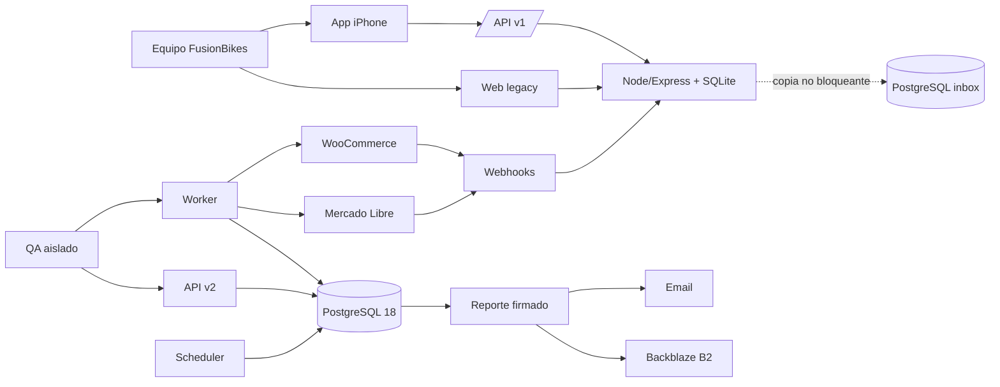
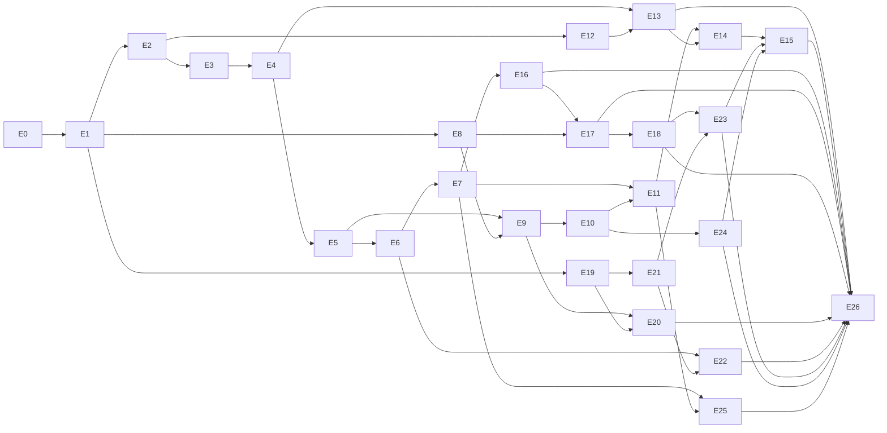
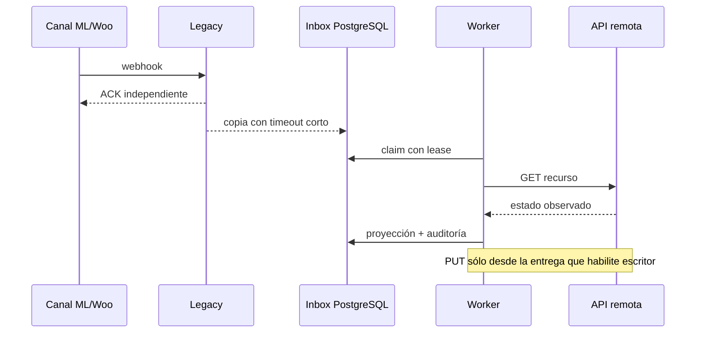

# Atlas canónico de arquitectura E0–E26

**Corte verificado:** 2026-09-13

**Alcance detallado actual:** E0–E4

**Audiencia:** implementación, revisión técnica y operación

Este atlas contiene relaciones transversales. Las reglas exclusivas, casos de uso y contratos
ejecutables permanecen dentro de cada ficha. `existing` significa observado en Git; `future`, ruta
objetivo todavía inexistente; ninguno equivale a aceptación.

## Contexto del sistema

## DAG vigente

El camino inicial obligatorio es E0→E1. Después de E1 se abren catálogo (E2), pedidos importados
(E8) y base App (E19). E15 es deliberadamente posterior a E23/E24 para no retirar compatibilidad
usada por App, taller o impresión.

## Procesos objetivo

- API atiende contratos HTTP; no ejecuta trabajos periódicos.
- Scheduler encola; nunca realiza efectos remotos.
- Worker reclama con lease, relee, ejecuta cuando esté autorizado y confirma.
- Un timeout posterior a un posible efecto produce `uncertain`; sólo una relectura decide.
- El legado continúa respondiendo aunque PostgreSQL o la copia en sombra fallen.

## Propiedad de datos

| Dominio | Entrega de origen | Tablas objetivo | Escritor |
|---|---|---|---|
| Infraestructura y DR | E0 | `backup_catalog`, `wal_catalog`, `restore_drills` | procesos de infraestructura |
| Seguridad, auditoría y colas | E1 | `users`, `webauthn_credentials`, `audit_events`, `inbox_messages`, `outbox_commands`, `dead_letters` | API/worker/scheduler según tabla |
| Catálogo | E2 | `product_models`, `sellable_variants`, `external_representations`, `identifiers`, `bundle_versions` | dominio catálogo |
| Identidad | E3 | `identity_cases`, `identity_decisions`, `identity_evidence`, `identity_candidates`, `format_observations` | dominio identidad |
| Campaña remota | E4 | `migration_campaigns`, `remote_commands`, `remote_attempts` | API administrativa y worker |
| Stock, pedidos y posteriores | E5–E26 | definido por su ficha antes de pasar a planificada | dueño único por dominio |

## Mapa de repositorios y archivos

| Superficie | Estado | Función |
|---|---|---|
| `/opt/fusionbikes/herramientas/server.js` | existente/desplegada | proceso monolítico legacy, montajes y cron |
| `lib/identidadProductos.js`, `lib/matcherEngine.js`, `lib/guardiaMl.js` | existente | evidencia para E2–E4; no aceptación automática |
| `routes/identidadProductos.js`, `routes/matcher.js`, `routes/guardiaMl.js` | existente | contratos legacy a clasificar |
| `migrations/081`–`092`, `103` | existente | historia SQLite de identidad y webhooks |
| `scripts/qa/` y `deploy/qa/` | existente | QA/simulador a reutilizar tras verificar aislamiento |
| `plataforma/` | futura | módulos TypeScript y tres procesos objetivo |
| `/opt/fusionbikes/FusionBikes-App` | existente con discrepancia Git registrada | consumidor `/api/v1`; fuera de E0–E4 salvo passkeys reales |

## Tecnologías y servicios

| Elemento | Estado | Uso | Condición |
|---|---|---|---|
| Node.js 24.21.0 | observado | runtime actual y objetivo | fijar digest/versión en entrega |
| Docker 29.7.2 | observado | aislamiento QA/PostgreSQL | no implica compose PostgreSQL existente |
| PostgreSQL 18 | requerido | base canónica | E0 debe instalar y probar PITR |
| TypeScript estricto | elegido | `plataforma/` | todavía no instalado allí |
| Vitest/ESLint/Playwright/axe | existentes | unitarias, lint y E2E | ampliar scripts contractuales |
| Backblaze B2 | elegido | backups SQLite del legado, manifiestos y reportes firmados de E1 (PM-172) | el WAL de PostgreSQL **no** va a B2: repositorio local cifrado + copia en la Mac (PM-165, PM-167) |
| Mercado Libre API | requerido | avisos, relectura y efectos futuros | sin sondas autenticadas en esta documentación |
| WooCommerce REST API | requerido | catálogo, relectura y efectos futuros | sin sondas autenticadas en esta documentación |
| Librería WebAuthn mantenida | candidata | passkeys | elegir mediante decisión antes de E1 planificada |
| Proveedor email/monitoreo | candidato | reporte y alertas | no autoriza alta ni compra |

## Glosario operativo

| Término | Definición |
|---|---|
| fuente de verdad | sistema autorizado para decidir el valor vigente de un dato |
| evidencia | observación fechada y reproducible; no equivale a aceptación |
| sombra | ejecución que mide/proyecta sin gobernar la respuesta ni escribir remotamente |
| canario | subconjunto explícito que limita el primer efecto real |
| lease | derecho temporal y tokenizado a procesar un trabajo |
| idempotencia | repetición con la misma clave produce un único efecto lógico |
| respuesta incierta | el cliente desconoce si el remoto aplicó el efecto; bloquea repetición ciega |
| compensación | nuevo efecto que corrige otro confirmado; nunca borra la historia |
| paridad | igualdad de eventos enumerables dentro de una ventana |
| convergencia | igualdad del estado actual cuando no existe historial remoto enumerable |
| aceptada | entrega con gates técnicos y operativos cerrados explícitamente |

## Fuentes oficiales

Consultadas el 2026-09-13, sin credenciales: PostgreSQL 18 sobre
[PITR](https://www.postgresql.org/docs/18/continuous-archiving.html) y
[`pg_verifybackup`](https://www.postgresql.org/docs/18/app-pgverifybackup.html),
[Object Lock de Backblaze](https://www.backblaze.com/docs/cloud-storage-object-lock),
[registro de passkeys](https://developers.google.com/identity/passkeys/developer-guides/server-registration),
[seguridad de aplicaciones ML](https://developers.mercadolibre.com.ar/es_ar/descripcion-de-articulos/seguridad-apps) y
[notificaciones ML](https://developers.mercadolibre.com.ar/es_ar/productos-recibe-notificaciones).

La documentación actual de ML agrega `missed_feeds`, ventana de hasta dos días y `site_id` obligatorio
para `items`, además del ACK 200 en 500 ms. Esto se registra como hallazgo a reconciliar en E1: no
reemplaza por sí solo los barridos de estado ni autoriza cambiar producción.

El diseño aprobado de E1 T2 separa corrientes por cuenta+tópico+clase, conserva observaciones y
relaciones técnicas sin PII durante 400 días y cifra payloads con AES-256-GCM. El scheduler sólo
materializa corridas; el worker ejecuta adaptadores GET contra simulador.

El diseño de E1 T3 añade una frontera explícita entre aviso y verdad remota: el legado deja un recibo
SQLite mínimo y, después del ACK, intenta copiar una señal por una cola acotada. La plataforma relee
el recurso mediante un gateway legacy de operaciones GET tipadas; sólo esa respuesta entra en
observaciones e inbox. Las credenciales permanecen en el legado. ML y Woo usan cuentas y corrientes
distintas. `missed_feeds` es un suplemento de dos días para avisos que nunca obtuvieron ACK, mientras
los barridos reparan copias perdidas después del ACK. T3 concluye con un soak de 24 horas; la firma y
los siete días contractuales pertenecen a T4.
