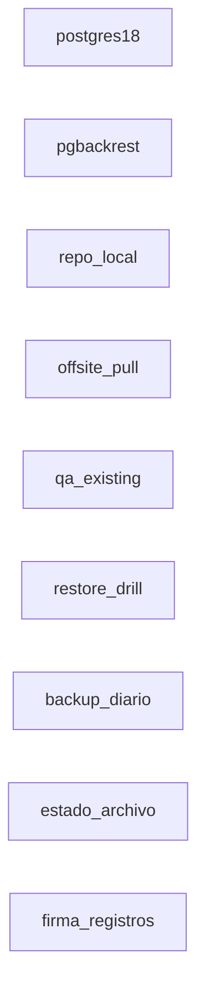
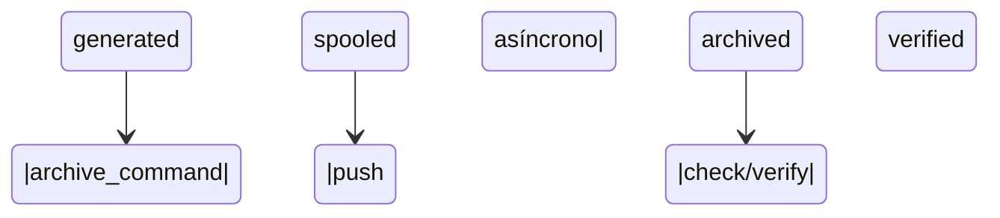
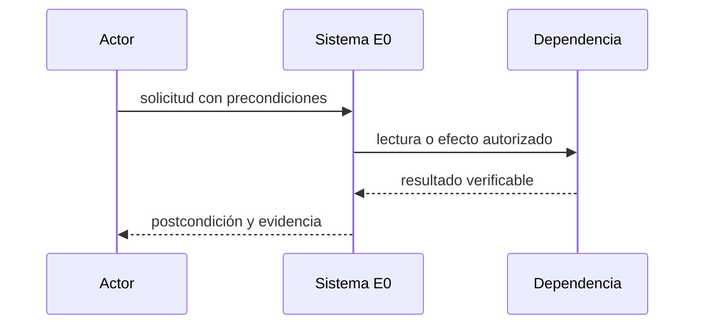
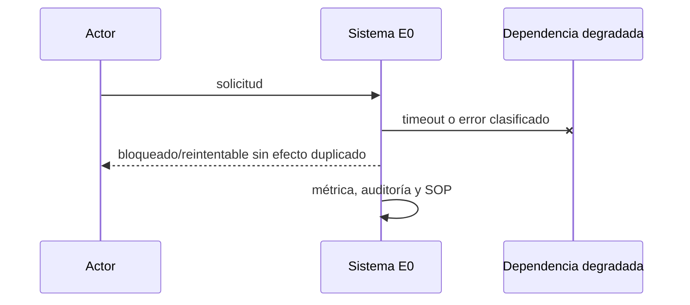

# E0 — Infraestructura, DR y PITR

**Estado:** desarrollo

**Dependencias:** ninguna

**Responsable operativo:** José

**Responsable técnico:** asistente

**Fuente canónica:** `docs/superpowers/plan-maestro.md`

## Resultado y límites

- DR de PostgreSQL 18 en dos niveles (PM-167): repositorio pgBackRest local cifrado con WAL continuo y PITR medido (RPO ≤ 5 min, RTO ≤ 1 h ante errores de base), copia externa descargada por una máquina propia ante pérdida total del VPS, y backups semanales de Hostinger como red de fondo.
- **Incluye:** PostgreSQL 18 por digest con volumen propio y límites; pgBackRest 2.59.x (PM-166) con archive-push asíncrono (sin límite de cola), compresión y cifrado de repositorio; restauración PITR en QA; copia externa por pull SSH de sólo lectura; alertas en Better Stack y vigía interno; capacidad y SOP de restauración.
- **No incluye:** No crea tablas de aplicación ni migra datos operativos; no usa almacenamiento pago ni Backblaze para PostgreSQL (PM-165); los backups diarios de Hostinger se activan después y no cuentan para la aceptación (PM-168).
- **Evidencia histórica absorbida:** P0, E23 recuperación. Es evidencia, no aceptación automática.

## Línea base verificada

- Al 2026-09-13: backups SQLite cifrados a B2 con 1.786.838.106 bytes de 10 GB gratis (`cat /opt/fusionbikes/backups/estado-nube.json`), vigía interno y heartbeat Better Stack activos, disco 33 GB libres / 66 % (`df -h /`), RAM 3,9 GB disponibles (`free -h`), Docker 29.7.2 (`docker version`), Node 24 y QA bajo demanda; Hostinger incluye backups semanales. Falta PostgreSQL, pgBackRest y PITR probado. Nivel 1 desplegado el 2026-09-13 22:36 UTC: contenedor fusion-pg sano con init, 127.0.0.1:5432, primer backup full verificado en 4 s (base 22,6 MB, repositorio 2,7 MB cifrado), registro firmado válido, manifiesto de 980 archivos, 0 segmentos WAL pendientes, 35 MB de RAM, legacy sin cambios (`docker compose -f deploy/postgres/compose.prod.yml -p fusion-pg exec -T pg pgbr info`). Aceptada 2026-09-14 por decisión de José. Evidencia nivel 1: 24 h de WAL (13/09 22:36 → 14/09 22:36 UTC) sin fallos de archivado dentro de la ventana, WAL continuo y pgbackrest verify OK, reinicio del VPS de 13:45 UTC superado sin pérdida, backups full (4 s) y diff (7 s) firmados, test:e0 8/8 (RTO 5 s, RPO ≤ 62 s), heartbeat de Better Stack activo y 0 incidentes del vigía. Evidencia nivel 2: tarea launchd en la Mac copiando cada hora con 1002 archivos verificados contra el manifiesto; script scripts/postgres/restaurar-desde-mac.sh ensayado en el VPS (RTO 7 s).
- Fotografía común: `docs/superpowers/audit-baseline-2026-09-13.md`. Al iniciar se debe refrescar con los mismos comandos y registrar fecha, commit y origen.
- Toda diferencia entre Git, despliegue y base se registra como hallazgo bloqueante; no se rellena por inferencia.

## Decisiones e invariantes

- PostgreSQL es destino canónico; cambios de negocio son transaccionales, auditados y atribuibles.
- Ningún efecto remoto se considera exitoso hasta releer y verificar el recurso; respuesta incierta bloquea repetición ciega.
- Un solo escritor remoto por vertical; idempotencia, versión esperada, leases y DLQ son obligatorios.
- `archive_command` (pgBackRest archive-push asíncrono) devuelve 0 a PostgreSQL sólo cuando el segmento llegó al repositorio; el spool guarda archivos de estado, no copias del WAL, y mientras no se archive PostgreSQL conserva el segmento en pg_wal (.ready). Sin `archive-push-queue-max` (PM-177, 2026-09-15): superarlo hacía que pgBackRest informara el WAL como archivado, lo descartara y cortara el PITR; ahora un disco lleno detiene PostgreSQL y la protección previa son las alertas de capacidad (disco del host, pg_wal y bytes en cola). El repositorio local no protege la pérdida total del VPS: eso lo cubre el nivel 2. El contenedor corre con init como PID 1: sin él, la muerte del push asíncrono reinicia postgres (medido 2026-09-13).

## Diseño, datos e interfaces

- **Modelo:** Sin tablas de aplicación. El catálogo de backups y WAL lo gestiona pgBackRest (`pgbackrest info --output=json`); cada simulacro de restauración deja un registro JSON firmado (target, inicio, fin, RPO, RTO, consultas centinela) fuera del cluster restaurado.
- **Interfaces:** Healthcheck interno de PostgreSQL en 127.0.0.1, `pgbackrest check` e `info`, y para el vigía: segmentos .ready (cantidad, bytes y antigüedad), tamaño de pg_wal y ocupación del disco del host; ninguna API de negocio.
- Los endpoints nuevos viven bajo `/api/v2`, usan errores `{code,message,correlation_id,details?}`, autorización por capacidad y paginación por cursor.
- Las mutaciones requieren `Idempotency-Key`; las actualizaciones concurrentes requieren `expected_version` y responden 409 sin efecto parcial.
- Eventos/auditoría son append-only; correcciones agregan un evento compensatorio y nunca reescriben historia.

## Integraciones, migración y recuperación

- **Migración:** No aplica a datos de negocio. Restaurar en QA, en un contenedor PostgreSQL aparte limitado a 512 MB, desde el repositorio hasta un instante elegido y medir RPO/RTO.
- ML/Woo se releen desde origen; los cursores tienen solape, deduplicación y cobertura observable. Límites de la API se documentan con fuente oficial y fecha.
- Fallos 403/408/429/5xx usan clasificación estable, backoff con jitter, límite de intentos y DLQ visible.
- El rollback vuelve consumidores o UI a sombra/read-only; no deshace efectos remotos confirmados y usa comandos compensatorios cuando corresponda.

## UI, operación y observabilidad

- Toda UI cubre cargando, vacío, degradado, error recuperable, conflicto y sólo lectura; web cumple 390/768/1440 y WCAG 2.2 AA.
- La App conserva contrato v1 mediante fachada mientras migra por OTA; offline nunca oculta conflictos.
- Métricas mínimas: entradas, procesadas, duplicadas, bloqueadas, reintentos, DLQ, latencia p95/p99, frescura y diferencias de conciliación.
- Cada alerta tiene umbral, canal, responsable, acuse y SOP; ningún `pending` queda fuera del scheduler.

## Pruebas y evidencia

- **Comando contractual:** pg_isready; pgbackrest check; backup completo + verify; caída del proceso de push sin perder segmentos (PostgreSQL los conserva en pg_wal hasta archivarlos); restauración PITR a un instante con RPO/RTO medidos; restauración desde la copia subida por la máquina del nivel 2.
- El comando `npm run test:e0` debe existir antes de pasar a `desarrollo`; no puede ser un alias vacío y debe fallar si falta un escenario obligatorio.
- Registrar salida literal, commit, fixture, fecha, duración y omisiones. Tests existentes sólo cuentan si cubren el contrato nuevo.
- Revisión independiente sin críticos/altos, suite global serial, restauración aplicable y E2E/dispositivo/hardware según superficie.

## Rollout, rollback y aceptación

- **Despliegue:** Nivel 1: desplegar sin conexiones de aplicación, observar 24 h de WAL, restaurar en QA y aceptar con vigías verdes. Nivel 2: instalar la tarea de pull en la máquina elegida y restaurar una vez desde esa copia.
- Todo corte de autoridad dura <15 minutos, comienza con backup/restauración vigentes y se aborta ante discrepancia crítica, doble escritor, cola ciega o disco fuera de umbral.
- **Aceptación técnica y operativa:** Nivel 1: RPO ≤ 5 min y RTO ≤ 1 h medidos, backup y restore repetibles. Nivel 2: copia externa al día y restaurable con el RPO declarado según la disponibilidad de la máquina. Ninguna degradación del servicio legacy.
- Código construido pero no usado no cuenta como observado; publicación no equivale a aceptación.

## Continuidad

- **Próxima acción exacta:** Reabierta 2026-09-15 por revisión técnica. Para volver a aceptar: (1) quitar archive-push-queue-max y recrear el contenedor con test:e0 verde; (2) vigía de capacidad en producción (disco, pg_wal, cola .ready) con estado nuevo publicado; (3) restauración real desde la copia subida por la Mac con scripts/postgres/restaurar-desde-mac.sh; (4) fichas coherentes con lo desplegado.
- Esta ficha queda bloqueada si contiene decisiones abiertas, cifras sin consulta reproducible, interfaces supuestas o rollback genérico.
- No registrar secretos, tokens, PII, volcados de producción ni razonamiento privado.


## Vista de arquitectura de la entrega



| Componente | Estado | Ruta | Responsabilidad |
|---|---|---|---|
| postgres18 | existing | deploy/postgres/compose.yml | cluster vacío en 127.0.0.1, digest fijado, init como PID 1, 768 MB, volumen propio |
| pgbackrest | existing | deploy/postgres/pgbackrest.conf | archive-push asíncrono sin límite de cola (PM-177), compresión zstd, cifrado aes-256-cbc, retención |
| repo_local | existing | deploy/postgres/compose.prod.yml | repositorio pgBackRest cifrado en el volumen /opt/fusionbikes/postgres/repo (montado en /var/lib/pgbackrest) |
| offsite_pull | existing | scripts/postgres/offsite-pull-mac.sh | tarea launchd en la Mac: rsync de sólo lectura del repositorio y verificación de hashes |
| qa_existing | existing | scripts/qa/qa.sh | entorno QA bajo demanda existente |
| restore_drill | existing | scripts/postgres/test-e0.sh | ensayo de restauración a un instante con registro firmado |
| backup_diario | existing | scripts/postgres/backup-diario.sh | backup full dominical y diferencial diario con verify y estado |
| estado_archivo | existing | scripts/postgres/estado-archivo.sh | cada 5 min: segmentos .ready (cantidad, bytes, antigüedad), tamaño de pg_wal y disco del host |
| firma_registros | existing | scripts/postgres/firmar-registro.sh | firma y verificación Ed25519 de registros de ensayo y backup |

## Actores, tecnologías y dependencias externas

- **Actores:** operador_infraestructura, revisor_tecnico, jose_aceptacion.
- **Tecnologías:** PostgreSQL 18.x por digest, pgBackRest 2.59.x, Docker 29.7.2 observado, SSH sólo lectura, SHA-256.

| Servicio | Estado | Finalidad |
|---|---|---|
| Better Stack | chosen | heartbeat del backup PostgreSQL y /healthz; alertas de capacidad por el vigía interno (incidentes y email) |
| Hostinger backups semanales | chosen | red de fondo incluida en el plan; RPO hasta 7 días |
| Hostinger backups diarios | candidate | se activan más adelante (PM-168); no cuentan para la aceptación |
| Mac del local (nivel 2, PM-169) | chosen | descarga el repositorio por SSH de sólo lectura mientras está encendida (horario del local) |

Un servicio `candidate` no autoriza contratación, instalación ni uso de credenciales.

## Casos de uso y guía operativa

| ID | Actor | Precondición | Disparador | Flujo principal | Alternativas | Errores | Postcondición | Prueba | Evidencia |
|---|---|---|---|---|---|---|---|---|---|
| E0-UC1 | operador_infraestructura | cluster vacío, stanza creada y clave de cifrado fuera del repo | backup programado diario | backup, verify y confirmación en info | disco ≥ 80 % o cola de WAL ≥ 1 GiB alerta antes de que PostgreSQL se detenga | WAL faltante o verify con error bloquea aceptación | backup verificable | E0-WAL-03 | salida de pgbackrest backup/verify/info |
| E0-UC2 | revisor_tecnico | backup y WAL continuos | simulacro mensual o antes de aceptar | restaurar en QA a un instante elegido y medir | timeline alterna se registra sin pisar el origen | restore no arranca o excede RPO/RTO | cluster de QA consultable | E0-PITR-01 | registro firmado con tiempos y consultas centinela |
| E0-UC3 | operador_infraestructura | máquina del nivel 2 confirmada y clave SSH de sólo lectura | tarea programada en la máquina | descargar repositorio, verificar hash y restaurar una vez | máquina apagada: se pone al día al volver | hash distinto o descarga incompleta alerta | copia externa restaurable | E0-OFF-01 | log de pull con hashes y restore de prueba |

La guía operativa para cada caso es: verificar precondiciones; registrar commit, actor y hora; ejecutar
el flujo sin saltar guardas; ante una alternativa seguir su rama; ante error detener ampliación,
preservar evidencia y aplicar el SOP; comprobar postcondición y adjuntar la evidencia indicada.

## Modelo relacional detallado

| Entidad | PK | Restricciones | Índices | Dueño | Retención | PII |
|---|---|---|---|---|---|---|
| repositorio pgBackRest | stanza + backup label | cifrado obligatorio; verify sin errores antes de aceptar | gestionados por pgBackRest | infraestructura | 2 completos + WAL necesario (repo-retention-full=2) | cifrada en reposo |
| registro de simulacro | drill_id (UTC) | target, inicio, fin, RPO, RTO y consultas centinela obligatorios; firmado | archivo por fecha | infraestructura | permanente | none |
| cola de archivado (pg_wal/archive_status) | segmento WAL | PostgreSQL conserva el segmento hasta que archive_command devuelve 0; nunca se descarta (sin archive-push-queue-max) | n/a | infraestructura | hasta confirmación en el repositorio | en claro dentro del volumen; cifrado al pasar al repositorio |

Las entidades objetivo son `future`: su nombre y contrato quedan fijados para el diseño, pero ninguna
tabla se declara existente hasta observar su migración aplicada y consultar su esquema.

## Máquina de estados y transiciones



| Desde | Evento | Guarda | Hasta | Efecto | Error | Prueba |
|---|---|---|---|---|---|---|
| generated | archive_command | segmento completo o archive_timeout=60s | spooled | pgBackRest encola el push asíncrono; el segmento sigue en pg_wal como .ready | devuelve no-cero y PostgreSQL conserva el WAL | E0-WAL-01 |
| spooled | push asíncrono | repositorio disponible | archived | copia comprimida y cifrada al repositorio; recién entonces archive_command devuelve 0 y PostgreSQL puede reciclar el segmento | el segmento queda en pg_wal; alerta si el más viejo supera 3 min o la cola 1 GiB | E0-WAL-02 |
| archived | check/verify | segmento legible y continuo | verified | registra evidencia en info | blocked: invalida backup dependiente | E0-WAL-03 |

## Secuencias normal, degradada e incierta





```mermaid
sequenceDiagram
  participant W as Worker
  participant D as Dependencia remota
  W->>D: operación idempotente
  D--xW: respuesta perdida
  W->>W: estado uncertain; no repetir
  W->>D: GET de reconciliación
  D-->>W: estado observado
  W->>W: confirmar o compensar
```

## Contratos API

Esta entrega no expone API de negocio.

## Fallos, recuperación y SOP

- archive-push-queue-max descarta WAL y corta el PITR: prohibido en la configuración (PM-177)
- disco del host lleno detiene PostgreSQL: alertas de capacidad en 80 % (aviso) y 90 % (crítico), cola .ready ≥ 1/4 GiB y pg_wal ≥ 2/8 GiB
- contenedor PostgreSQL con init como PID 1 (compose init: true): sin init, pgBackRest asíncrono queda huérfano de postgres y su muerte (OOM, kill) provoca recuperación de arranque con corte de todas las conexiones (medido 2026-09-13)
- WAL faltante invalida el backup dependiente
- verify verde no reemplaza una restauración real
- pérdida de la clave de cifrado vuelve irrecuperable el repositorio: copia fuera del VPS obligatoria
- máquina del nivel 2 apagada: el RPO de pérdida total crece hasta que vuelve
- RPO de pérdida total hasta la última sincronización del día hábil (Mac en horario del local)

El SOP común es: congelar ampliación; conservar payloads redactados, hashes y correlation ID; comprobar
fuente remota sin escribir; clasificar retryable/uncertain/terminal; reparar mediante replay idempotente
o compensación; demostrar conciliación; sólo entonces reanudar.

## Integraciones, observabilidad, rollout y rollback

- **Integración:** PostgreSQL: archive_command = pgbackrest archive-push asíncrono; archive_timeout 60 s
- **Integración:** Nivel 2: pull por SSH con clave de sólo lectura desde la máquina propia; nada se empuja desde el VPS
- **Observación:** archive lag: alerta > 3 min, crítico > 5 min
- **Observación:** capacidad: disco del host ≥ 80 % aviso / ≥ 90 % crítico; cola .ready ≥ 1 GiB / ≥ 4 GiB; pg_wal ≥ 2 GiB / ≥ 8 GiB; sin medición → crítico
- **Observación:** último backup verificado: alerta si > 26 h (y heartbeat de Better Stack)
- **Observación:** RPO y RTO por simulacro; copia externa: antigüedad del último pull
- **Rollout:** cluster vacío sin clientes, 24 h de WAL, backup, restore en QA y aceptación del nivel 1; luego pull y restore desde la máquina del nivel 2
- **Rollback:** detener clientes nuevos; conservar cluster, spool y repositorio; el legacy no cambia

## Plan de implementación por cortes revisables

1. Congelar línea base, fuentes y fixture sin PII; commit sólo documental/evidencia.
2. Crear migraciones y restricciones con pruebas fallando; commit de esquema aislado.
3. Implementar dominio y máquinas de estado sin efectos remotos; commit unitario.
4. Añadir contratos, adaptadores y simulador; commit de integración.
5. Añadir UI/SOP/observabilidad y pruebas contractuales; commit operable.
6. Ensayar sombra, canario, aborto y rollback; adjuntar evidencia sin mezclar cambios.

## Matriz de trazabilidad

| Requisito | Diseño | Archivo | Migración | Prueba | Métrica | Evidencia |
|---|---|---|---|---|---|---|
| RPO<=5m nivel 1 | entidades/transiciones/API de esta ficha | deploy/postgres/compose.yml | migración E0 aún no creada | E0-WAL-01 | RPO<=5m nivel 1 | salida literal + commit + fecha |
| RTO<=60m nivel 1 | entidades/transiciones/API de esta ficha | deploy/postgres/compose.yml | migración E0 aún no creada | E0-WAL-02 | RTO<=60m nivel 1 | salida literal + commit + fecha |
| 0 impacto legacy | entidades/transiciones/API de esta ficha | deploy/postgres/compose.yml | migración E0 aún no creada | E0-WAL-03 | 0 impacto legacy | salida literal + commit + fecha |
| restore mensual | entidades/transiciones/API de esta ficha | deploy/postgres/compose.yml | migración E0 aún no creada | E0-PITR-01 | restore mensual | salida literal + commit + fecha |
| copia externa restaurable | entidades/transiciones/API de esta ficha | deploy/postgres/compose.yml | migración E0 aún no creada | E0-RPO-01 | copia externa restaurable | salida literal + commit + fecha |

## Fuentes y decisiones abiertas

- https://www.postgresql.org/docs/18/continuous-archiving.html — consultada 2026-09-13.
- https://pgbackrest.org/release.html — consultada 2026-09-13.
- https://pgbackrest.org/user-guide.html — consultada 2026-09-13.
- https://www.hostinger.com/support/1583232-how-to-back-up-or-restore-a-vps-at-hostinger/ — consultada 2026-09-13.

**Decisiones abiertas:** ninguna.

## Decisiones PM asignadas

- **Dueña:** PM-165, PM-166, PM-167, PM-168, PM-169, PM-177
- **Consumidora:** ninguna
