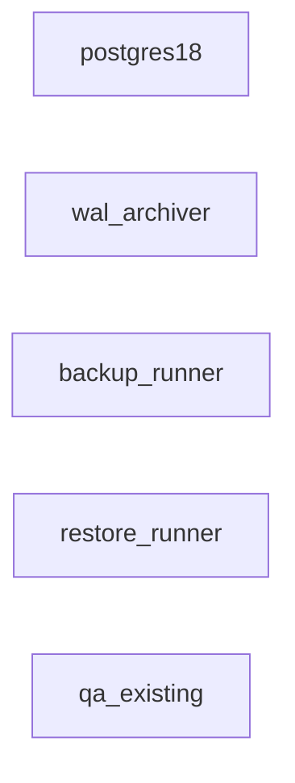
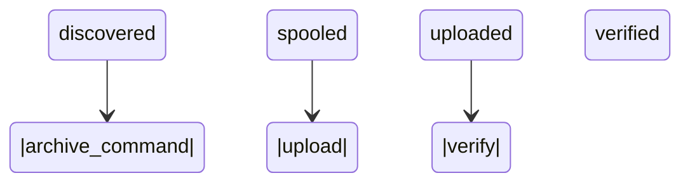
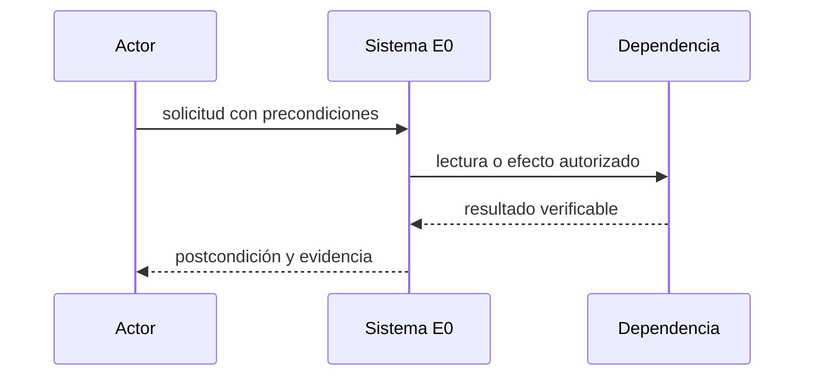
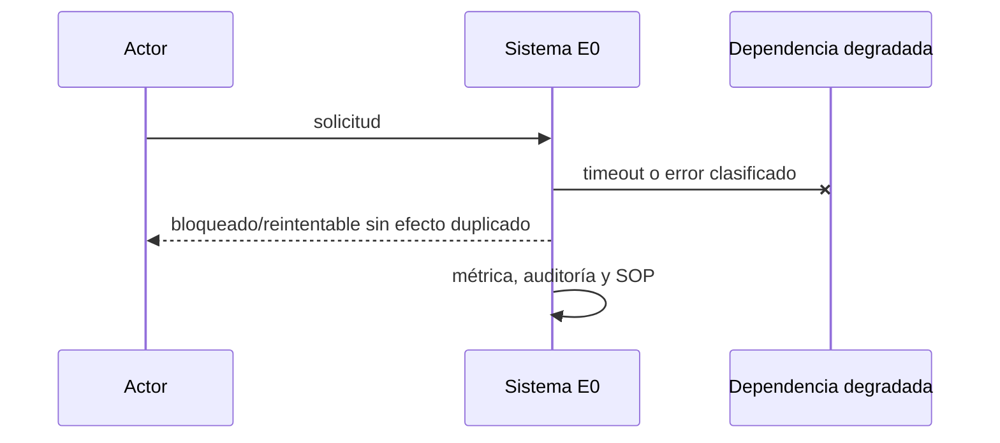

# E0 — Infraestructura, DR y PITR

**Estado:** borrador

**Dependencias:** ninguna

**Responsable operativo:** José

**Responsable técnico:** asistente

**Fuente canónica:** `docs/superpowers/plan-maestro.md`

## Resultado y límites

- PostgreSQL 18 vacío y aislado, WAL continuo, backup base verificable y restauración PITR medida con RPO ≤ 5 min y RTO ≤ 1 h.
- **Incluye:** PostgreSQL por digest, volumen propio, archive_command no bloqueante, B2 Object Lock, pg_verifybackup, QA aislado, capacidad, alertas y SOP de restauración.
- **No incluye:** No crea tablas de aplicación ni migra datos operativos.
- **Evidencia histórica absorbida:** P0, E23 recuperación. Es evidencia, no aceptación automática.

## Línea base verificada

- Backups SQLite/B2, monitoreo, disco, Node 24 y QA bajo demanda existen; falta PostgreSQL y PITR probado.
- Fotografía común: `docs/superpowers/audit-baseline-2026-09-13.md`. Al iniciar se debe refrescar con los mismos comandos y registrar fecha, commit y origen.
- Toda diferencia entre Git, despliegue y base se registra como hallazgo bloqueante; no se rellena por inferencia.

## Decisiones e invariantes

- PostgreSQL es destino canónico; cambios de negocio son transaccionales, auditados y atribuibles.
- Ningún efecto remoto se considera exitoso hasta releer y verificar el recurso; respuesta incierta bloquea repetición ciega.
- Un solo escritor remoto por vertical; idempotencia, versión esperada, leases y DLQ son obligatorios.
- Una caída de B2 no puede bloquear PostgreSQL: spool local acotado, alertas al 70 % de disco y procedimiento de emergencia sin borrar WAL no archivado.

## Diseño, datos e interfaces

- **Modelo:** Instancia vacía; catálogo de backups y WAL con hash, fecha, rango LSN, retención y resultado de verificación.
- **Interfaces:** Healthcheck interno de PostgreSQL y métricas de backup/WAL; ninguna API de negocio.
- Los endpoints nuevos viven bajo `/api/v2`, usan errores `{code,message,correlation_id,details?}`, autorización por capacidad y paginación por cursor.
- Las mutaciones requieren `Idempotency-Key`; las actualizaciones concurrentes requieren `expected_version` y responden 409 sin efecto parcial.
- Eventos/auditoría son append-only; correcciones agregan un evento compensatorio y nunca reescriben historia.

## Integraciones, migración y recuperación

- **Migración:** No aplica a datos de negocio. Restaurar en QA desde backup base más WAL hasta un instante elegido.
- ML/Woo se releen desde origen; los cursores tienen solape, deduplicación y cobertura observable. Límites de la API se documentan con fuente oficial y fecha.
- Fallos 403/408/429/5xx usan clasificación estable, backoff con jitter, límite de intentos y DLQ visible.
- El rollback vuelve consumidores o UI a sombra/read-only; no deshace efectos remotos confirmados y usa comandos compensatorios cuando corresponda.

## UI, operación y observabilidad

- Toda UI cubre cargando, vacío, degradado, error recuperable, conflicto y sólo lectura; web cumple 390/768/1440 y WCAG 2.2 AA.
- La App conserva contrato v1 mediante fachada mientras migra por OTA; offline nunca oculta conflictos.
- Métricas mínimas: entradas, procesadas, duplicadas, bloqueadas, reintentos, DLQ, latencia p95/p99, frescura y diferencias de conciliación.
- Cada alerta tiene umbral, canal, responsable, acuse y SOP; ningún `pending` queda fuera del scheduler.

## Pruebas y evidencia

- **Comando contractual:** pg_isready; pg_verifybackup sobre cada base backup; restauración PITR mensual; prueba de pérdida del uploader y medición de RPO/RTO.
- El comando `npm run test:e0` debe existir antes de pasar a `desarrollo`; no puede ser un alias vacío y debe fallar si falta un escenario obligatorio.
- Registrar salida literal, commit, fixture, fecha, duración y omisiones. Tests existentes sólo cuentan si cubren el contrato nuevo.
- Revisión independiente sin críticos/altos, suite global serial, restauración aplicable y E2E/dispositivo/hardware según superficie.

## Rollout, rollback y aceptación

- **Despliegue:** Desplegar sin conexiones de aplicación, observar 24 h de WAL, ejecutar restore QA y aceptar sólo con vigías verdes.
- Todo corte de autoridad dura <15 minutos, comienza con backup/restauración vigentes y se aborta ante discrepancia crítica, doble escritor, cola ciega o disco fuera de umbral.
- **Aceptación técnica y operativa:** Backup y restore repetibles; RPO/RTO medidos; ninguna degradación del servicio legacy.
- Código construido pero no usado no cuenta como observado; publicación no equivale a aceptación.

## Continuidad

- **Próxima acción exacta:** Escribir y aprobar el procedimiento PostgreSQL+PITR, ejecutarlo y adjuntar evidencia literal.
- Esta ficha queda bloqueada si contiene decisiones abiertas, cifras sin consulta reproducible, interfaces supuestas o rollback genérico.
- No registrar secretos, tokens, PII, volcados de producción ni razonamiento privado.


## Vista de arquitectura de la entrega



| Componente | Estado | Ruta | Responsabilidad |
|---|---|---|---|
| postgres18 | future | deploy/postgres/compose.yml | cluster vacío aislado y fijado por digest |
| wal_archiver | future | scripts/postgres/archive-wal.sh | spool local y carga idempotente a B2 |
| backup_runner | future | scripts/postgres/base-backup.sh | backup base, manifiesto y verificación |
| restore_runner | future | scripts/postgres/restore-pitr.sh | restore sanitario y medición RPO/RTO |
| qa_existing | existing | scripts/qa/qa.sh | entorno QA bajo demanda existente |

## Actores, tecnologías y dependencias externas

- **Actores:** operador_infraestructura, revisor_tecnico, jose_aceptacion.
- **Tecnologías:** PostgreSQL 18.x por digest, Docker 29.7.2 observado, Backblaze B2 S3 API, Bash estricto, SHA-256.

| Servicio | Estado | Finalidad |
|---|---|---|
| Backblaze B2 | chosen | WAL, backups y evidencia inmutable |
| servicio de monitoreo | candidate | alertas de WAL, disco y restore |

Un servicio `candidate` no autoriza contratación, instalación ni uso de credenciales.

## Casos de uso y guía operativa

| ID | Actor | Precondición | Disparador | Flujo principal | Alternativas | Errores | Postcondición | Prueba | Evidencia |
|---|---|---|---|---|---|---|---|---|---|
| E0-UC1 | operador_infraestructura | cluster vacío y B2 configurado fuera del repo | ventana de backup | crear backup base, verificar manifiesto, subir y confirmar lectura | B2 caído conserva spool y alerta | hash distinto o WAL faltante bloquea aceptación | backup verificable y catálogo firmado | E0-WAL-01 | salida pg_verifybackup y manifiesto |
| E0-UC2 | revisor_tecnico | backup y WAL continuos disponibles | simulacro mensual | restaurar en QA a target elegido y medir | timeline alterna se registra sin pisar origen | restore no arranca o excede RPO/RTO | cluster sanitario consultable | E0-PITR-01 | log, tiempos y consultas centinela |

La guía operativa para cada caso es: verificar precondiciones; registrar commit, actor y hora; ejecutar
el flujo sin saltar guardas; ante una alternativa seguir su rama; ante error detener ampliación,
preservar evidencia y aplicar el SOP; comprobar postcondición y adjuntar la evidencia indicada.

## Modelo relacional detallado

| Entidad | PK | Restricciones | Índices | Dueño | Retención | PII |
|---|---|---|---|---|---|---|
| backup_catalog | backup_id | sha256 único; system_identifier y LSN obligatorios | created_at, status | infraestructura | según política aprobada | none |
| wal_catalog | timeline+segment | hash único; no marcar uploaded sin HEAD/GET confirmado | archived_at, status | infraestructura | hasta vencer backups dependientes | none |
| restore_drills | drill_id | target, inicio, fin, RPO y RTO obligatorios | finished_at | infraestructura | permanente | none |

Las entidades objetivo son `future`: su nombre y contrato quedan fijados para el diseño, pero ninguna
tabla se declara existente hasta observar su migración aplicada y consultar su esquema.

## Máquina de estados y transiciones



| Desde | Evento | Guarda | Hasta | Efecto | Error | Prueba |
|---|---|---|---|---|---|---|
| discovered | archive_command | segmento completo | spooled | copia atómica local | blocked | E0-WAL-01 |
| spooled | upload | B2 disponible | uploaded | PUT idempotente | permanece spooled | E0-WAL-02 |
| uploaded | verify | hash y objeto legibles | verified | registra evidencia | blocked | E0-WAL-03 |

## Secuencias normal, degradada e incierta





```mermaid
sequenceDiagram
  participant W as Worker
  participant D as Dependencia remota
  W->>D: operación idempotente
  D--xW: respuesta perdida
  W->>W: estado uncertain; no repetir
  W->>D: GET de reconciliación
  D-->>W: estado observado
  W->>W: confirmar o compensar
```

## Contratos API

Esta entrega no expone API de negocio.

## Fallos, recuperación y SOP

- B2 no debe bloquear archive_command
- spool al 70% alerta y detiene ampliación
- WAL faltante invalida el backup
- pg_verifybackup verde no reemplaza restore real
- configuración PostgreSQL se respalda aparte

El SOP común es: congelar ampliación; conservar payloads redactados, hashes y correlation ID; comprobar
fuente remota sin escribir; clasificar retryable/uncertain/terminal; reparar mediante replay idempotente
o compensación; demostrar conciliación; sólo entonces reanudar.

## Integraciones, observabilidad, rollout y rollback

- **Integración:** B2: PUT idempotente, HEAD/GET de confirmación, timeout y spool local
- **Integración:** PostgreSQL: archive_command devuelve no-cero sin borrar WAL ante fallo
- **Observación:** archive lag y último WAL verificado
- **Observación:** spool/disco con alerta al 70%
- **Observación:** RPO y RTO por simulacro
- **Rollout:** cluster vacío sin clientes, 24h de WAL, backup, restore QA y aceptación
- **Rollback:** detener clientes nuevos; conservar cluster, spool y objetos; legacy no cambia

## Plan de implementación por cortes revisables

1. Congelar línea base, fuentes y fixture sin PII; commit sólo documental/evidencia.
2. Crear migraciones y restricciones con pruebas fallando; commit de esquema aislado.
3. Implementar dominio y máquinas de estado sin efectos remotos; commit unitario.
4. Añadir contratos, adaptadores y simulador; commit de integración.
5. Añadir UI/SOP/observabilidad y pruebas contractuales; commit operable.
6. Ensayar sombra, canario, aborto y rollback; adjuntar evidencia sin mezclar cambios.

## Matriz de trazabilidad

| Requisito | Diseño | Archivo | Migración | Prueba | Métrica | Evidencia |
|---|---|---|---|---|---|---|
| RPO<=5m | entidades/transiciones/API de esta ficha | deploy/postgres/compose.yml | migración E0 aún no creada | E0-WAL-01 | RPO<=5m | salida literal + commit + fecha |
| RTO<=60m | entidades/transiciones/API de esta ficha | deploy/postgres/compose.yml | migración E0 aún no creada | E0-WAL-02 | RTO<=60m | salida literal + commit + fecha |
| 0 impacto legacy | entidades/transiciones/API de esta ficha | deploy/postgres/compose.yml | migración E0 aún no creada | E0-WAL-03 | 0 impacto legacy | salida literal + commit + fecha |
| restore mensual | entidades/transiciones/API de esta ficha | deploy/postgres/compose.yml | migración E0 aún no creada | E0-PITR-01 | restore mensual | salida literal + commit + fecha |

## Fuentes y decisiones abiertas

- https://www.postgresql.org/docs/18/continuous-archiving.html — consultada 2026-09-13.
- https://www.postgresql.org/docs/18/app-pgverifybackup.html — consultada 2026-09-13.
- https://www.backblaze.com/docs/cloud-storage-object-lock — consultada 2026-09-13.

**Decisiones abiertas que mantienen la ficha en borrador:** retención exacta B2; proveedor/canal de monitoreo; dominio y certificado QA.

## Decisiones PM asignadas

- **Dueña:** ninguna
- **Consumidora:** ninguna
