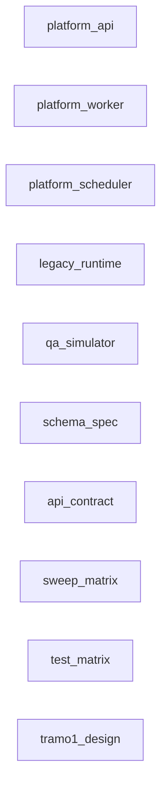
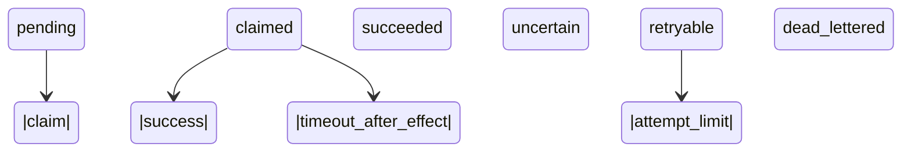
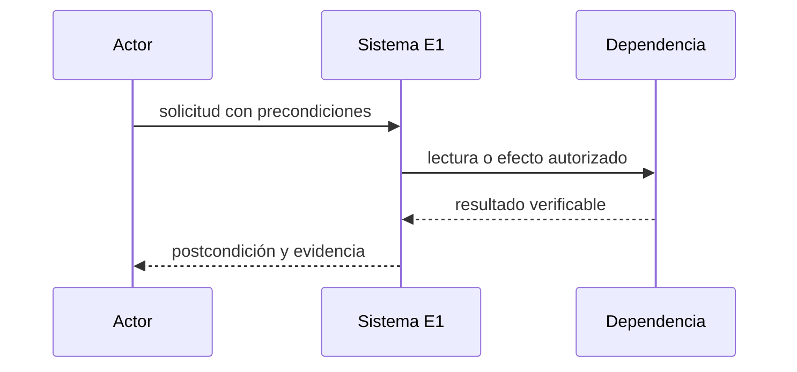
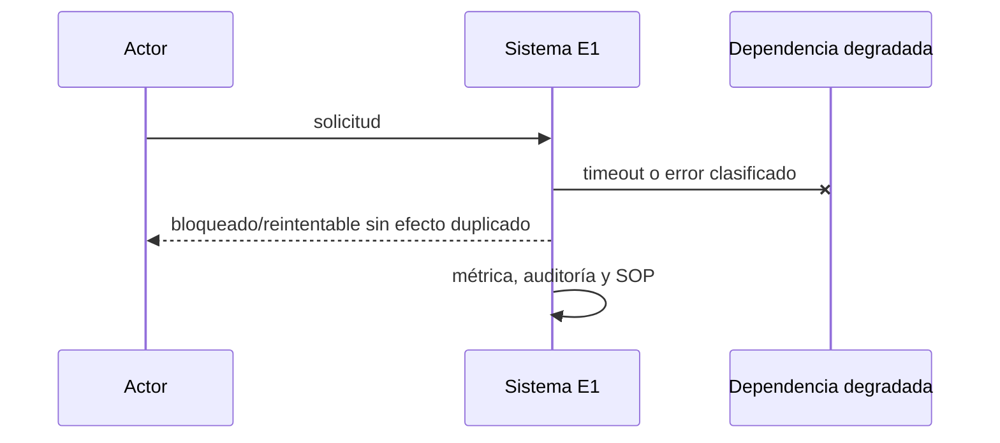

# E1 — Fundación PostgreSQL en sombra

**Estado:** planificada

**Dependencias:** E0

**Responsable operativo:** José

**Responsable técnico:** asistente

**Fuente canónica:** `docs/superpowers/plan-maestro.md`

## Resultado y límites

- Esquema base, auditoría encadenada, inbox/outbox/DLQ, API, worker y scheduler separados, passkeys desactivadas y reporte diario firmado de sombra.
- **Incluye:** Node 24/TypeScript estricto en plataforma/, PostgreSQL, roles, WebAuthn virtual, cifrado de PII, colas durables y barridos ML/Woo por tópico.
- **No incluye:** No entrega catálogo, stock, pedidos, pantallas operativas ni escritores remotos.
- **Evidencia histórica absorbida:** P1. Es evidencia, no aceptación automática.

## Línea base verificada

- El legado Node/Express/SQLite sigue atendiendo producción; existe plan P1 auditado archivado.
- Fotografía común: `docs/superpowers/audit-baseline-2026-09-13.md`. Al iniciar se debe refrescar con los mismos comandos y registrar fecha, commit y origen.
- Toda diferencia entre Git, despliegue y base se registra como hallazgo bloqueante; no se rellena por inferencia.

## Decisiones e invariantes

- PostgreSQL es destino canónico; cambios de negocio son transaccionales, auditados y atribuibles.
- Ningún efecto remoto se considera exitoso hasta releer y verificar el recurso; respuesta incierta bloquea repetición ciega.
- Un solo escritor remoto por vertical; idempotencia, versión esperada, leases y DLQ son obligatorios.
- La sombra jamás condiciona el ACK legacy. Estados sin historial enumerables se validan por convergencia; envíos usan cursor shipment.last_updated propio.

## Diseño, datos e interfaces

- **Modelo:** Esquema en docs/superpowers/specs/e1/schema.sql: core (companies, channel_accounts), security (users con email cifrado e índice ciego, roles, capabilities, webauthn_credentials, recovery_codes, feature_flags), audit (audit_events append-only con cadena de hash y verify_chain, audit_daily_manifests) e integrations (inbox_messages, outbox_commands, command_attempts, dead_letters, reconciliation_cursors, sweep_runs, shadow_copy_losses, daily_shadow_reports, vista incidents).
- **Interfaces:** GET /api/v2/health y GET /api/v2/incidents según openapi/platform-v2.yaml; reporte firmado en B2 (governance 365 d) y email por SMTP existente con adjuntos. No hay UI ni login real en E1.
- Los endpoints nuevos viven bajo `/api/v2`, usan errores `{code,message,correlation_id,details?}`, autorización por capacidad y paginación por cursor.
- Las mutaciones requieren `Idempotency-Key`; las actualizaciones concurrentes requieren `expected_version` y responden 409 sin efecto parcial.
- Eventos/auditoría son append-only; correcciones agregan un evento compensatorio y nunca reescriben historia.

## Integraciones, migración y recuperación

- **Migración:** Usuarios sin contraseñas; importación idempotente de metadatos, sin datos de negocio.
- ML/Woo se releen desde origen; los cursores tienen solape, deduplicación y cobertura observable. Límites de la API se documentan con fuente oficial y fecha.
- Fallos 403/408/429/5xx usan clasificación estable, backoff con jitter, límite de intentos y DLQ visible.
- El rollback vuelve consumidores o UI a sombra/read-only; no deshace efectos remotos confirmados y usa comandos compensatorios cuando corresponda.

## UI, operación y observabilidad

- Toda UI cubre cargando, vacío, degradado, error recuperable, conflicto y sólo lectura; web cumple 390/768/1440 y WCAG 2.2 AA.
- La App conserva contrato v1 mediante fachada mientras migra por OTA; offline nunca oculta conflictos.
- Métricas mínimas: entradas, procesadas, duplicadas, bloqueadas, reintentos, DLQ, latencia p95/p99, frescura y diferencias de conciliación.
- Cada alerta tiene umbral, canal, responsable, acuse y SOP; ningún `pending` queda fuera del scheduler.

## Pruebas y evidencia

- **Comando contractual:** npm run test:e1 con los escenarios de docs/superpowers/specs/e1/test-e1.md (esquema, auditoría, colas, duplicados, barridos por tópico, convergencia de envíos, borrados Woo, presupuesto de latencia, PostgreSQL caído, reporte firmado, WebAuthn virtual, capacidades, contrato y servicios separados).
- El comando `npm run test:e1` debe existir antes de pasar a `desarrollo`; no puede ser un alias vacío y debe fallar si falta un escenario obligatorio.
- Registrar salida literal, commit, fixture, fecha, duración y omisiones. Tests existentes sólo cuentan si cubren el contrato nuevo.
- Revisión independiente sin críticos/altos, suite global serial, restauración aplicable y E2E/dispositivo/hardware según superficie.

## Rollout, rollback y aceptación

- **Despliegue:** API/worker/scheduler sin credenciales de escritura; 7 días de sombra; aborto ante impacto en códigos HTTP, errores o latencia.
- Todo corte de autoridad dura <15 minutos, comienza con backup/restauración vigentes y se aborta ante discrepancia crítica, doble escritor, cola ciega o disco fuera de umbral.
- **Aceptación técnica y operativa:** 0 faltantes inexplicados por tópico, cobertura declarada, reportes firmados verificados y revisión de José.
- Código construido pero no usado no cuenta como observado; publicación no equivale a aceptación.

## Continuidad

- **Próxima acción exacta:** Tramo 1 (Fundación) con diseño aprobado en docs/superpowers/specs/2026-09-15-e1-tramo1-fundacion-design.md (PM-173..176): escribir el plan de implementación y ejecutarlo; luego tramos 2 (barridos), 3 (sombra en vivo, aprobación propia) y 4 (passkeys y reporte).
- Esta ficha queda bloqueada si contiene decisiones abiertas, cifras sin consulta reproducible, interfaces supuestas o rollback genérico.
- No registrar secretos, tokens, PII, volcados de producción ni razonamiento privado.

## Especificación vinculante incorporada

Este contenido forma parte de E1. Su copia archivada sólo acredita procedencia.

#### Decisiones fijadas

| Tema | Decisión | Origen |
|---|---|---|
| Ubicación del código | `plataforma/` dentro de este repo | José 2026-09-13 |
| Lenguaje y runtime | TypeScript estricto sobre Node 24 | plan §2.1 |
| Base | PostgreSQL 18 (última 18.x por digest) en Docker, mismo VPS | plan §2.1, §8 |
| Colas | inbox/outbox/comandos/intentos/DLQ en PostgreSQL con `FOR UPDATE SKIP LOCKED` | plan §2.1 |
| Auditoría | eventos encadenados por hash + manifiesto diario firmado en B2 con Object Lock | plan §4.1 |
| Claves de cifrado | archivo 600 en el VPS, fuera de repo y base, copia guardada por José fuera del VPS | José 2026-09-13 |
| Passkeys | catálogo y administración; iPhone, Mac/PC con biometría, compu sin biometría (QR/llave USB) y Android | José 2026-09-13, plan §4.2 |
| Prueba de passkeys | E1 las valida con autenticador virtual (WebAuthn en tests); la prueba en dispositivos reales es **condición para activarlas** en E2, cuando exista `qa-herramientas` con HTTPS | José 2026-09-13 |
| Procesos | API, worker y scheduler como **servicios separados** (misma imagen, contenedores distintos) | plan §2.1, revisión 2026-09-13 |
| Sombra | la copia al inbox nuevo **nunca** afecta el ACK ni el procesamiento del legado; la fuente de conciliación es la relectura de ML/Woo con barrido independiente por tópico | revisión 2026-09-13 |
| Acceso al reporte | **reporte diario firmado fuera de la UI**: se guarda en B2 y llega por email a José; E1 no expone pantallas con login. Acceso administrativo de emergencia sólo por consola en el VPS, auditado | José 2026-09-13 |
| Responsable | José valida el reporte de sombra; técnico: asistente | José 2026-09-13 |
| Capacidad | VPS actual (2 CPU, 7,8 GB, ~3,4 GB libres); ampliación futura sin fecha | José 2026-09-13 |

#### Presupuesto de recursos

| Proceso | RAM límite | CPU | Notas |
|---|---|---|---|
| PostgreSQL 18 (instalado en E0) | 768 MB | 0,75 | `shared_buffers` 192 MB; datos en volumen propio |
| API v2 (sombra) | 256 MB | 0,25 | sólo health, auth y lectura de estado |
| Worker | 192 MB | 0,2 | reclama y ejecuta mensajes; sin escritores remotos |
| Scheduler | 96 MB | 0,1 | sólo encola trabajos periódicos; no ejecuta efectos |
| **Total nuevo** | **~1,3 GB** | | deja ~2 GB libres; se mide antes y después |

Disco: PostgreSQL arranca < 1 GB; WAL archivado a B2, retención local mínima. Umbrales de Gate 0
siguen vigentes (alerta 70%).

#### Pasos

Cada paso termina en algo verificable y con tests. El orden importa: primero lo que protege datos.

#### 1. Esqueleto `plataforma/` y calidad
- `plataforma/package.json` (workspace del repo), `tsconfig` estricto, vitest, eslint, límites entre
  módulos (`catalog`, `identity`, `inventory`, `orders`, `fulfillment`, `integrations`, `security`,
  `audit`) verificados por lint: un módulo no importa internals de otro.
- Migraciones SQL versionadas (expand/contract) con un runner propio mínimo y tabla de control.
- **Aceptación:** `npm test` del repo corre los tests de `plataforma/` y del legado; CI local verde.

#### 2. Condición de entrada: E0 cerrado
- PostgreSQL vacío, WAL archivado a B2, base backups verificados y PITR medido pertenecen a E0
  (`deliveries/PLAT-0-gate0.md`). E1 no instala ni configura la base: aplica migraciones sobre ella.
- **Aceptación:** la ficha de E0 registra RPO/RTO medidos y el vigía de WAL activo.

#### 3. Esquema base y auditoría encadenada
- Tablas: `companies`, `channel_accounts`, `users`, `roles`, `capabilities`, `audit_events`
  (append-only, `prev_hash`/`hash` sobre contenido canónico), `audit_daily_manifests`.
- Triggers que impiden `UPDATE`/`DELETE` en `audit_events`; manifiesto diario firmado y subido a B2
  con Object Lock.
- Cifrado de PII por aplicación con clave externa; índices ciegos para búsquedas exactas.
- **Aceptación:** tests de restricciones (unicidad, FKs, archivo), cadena verificable de punta a
  punta, alteración de un evento detectada, manifiesto restaurable desde B2.

#### 4. Colas durables y workers
- `inbox_messages`, `outbox_commands`, `command_attempts`, `dead_letters` con reclamo transaccional,
  lease, reintentos con backoff y DLQ.
- Tres servicios separados sobre la misma imagen: API, worker (reclama y ejecuta) y scheduler (sólo
  encola periódicos, nunca ejecuta efectos). Caída de uno no detiene a los otros; cada uno con su
  healthcheck. Nada queda `pending` fuera del alcance del scheduler (`parked` explícito).
- **Aceptación:** tests de concurrencia (dos workers no toman el mismo mensaje), caída entre efecto y
  confirmación, reintentos 403/408/429/5xx con fixtures, DLQ visible en `/api/v2/incidents`.

#### 5. Autenticación con passkeys y roles
- WebAuthn (passkeys) para catálogo y administración, códigos de recuperación de un solo uso,
  reautenticación reciente para acciones de riesgo; operador puede seguir con contraseña.
- Roles base operador, catálogo, administración + capacidades finas; migración de usuarios del
  legado sin sus contraseñas (se enrolan).
- **Aceptación en E1:** enrolamiento, login, reautenticación y recuperación verificados con
  autenticador virtual WebAuthn en tests (incluye autenticación cruzada simulada). Las passkeys quedan
  **desactivadas para uso real** (flag).
- **Condición para activarlas (E2):** con `qa-herramientas.fusionbikes.com.ar` en HTTPS, José prueba
  enrolamiento y login en iPhone, Mac/PC con Touch ID o Windows Hello, compu sin biometría con iPhone
  vía QR, y Android. Sin esa prueba no se activan.

#### 6. Ingesta en sombra y reporte de diferencias
- **No bloqueante para el legado:** el webhook se responde y procesa exactamente como hoy. La copia al
  `inbox_messages` nuevo ocurre después, fuera de la transacción del legado, con timeout corto. Si
  PostgreSQL no está o falla, la copia se descarta con una métrica y **no** se reintenta desde el
  handler: el ACK a ML/Woo nunca depende de la base nueva.
- **Reparación por barrido independiente por tópico:** si la copia se perdió, también se perdió el
  identificador notificado; por eso la reparación **no** depende del aviso: cada tópico tiene su propio
  barrido de la API remota con cursor persistido, y la fuente de conciliación es **la API remota**, no
  la base del legado ni la copia.

  | Canal / tópico | Barrido | Cursor | Borrados / bajas | Limitaciones conocidas |
  |---|---|---|---|---|
  | ML `orders` / `orders_v2` | `/orders/search` por `order.date_last_updated` | última fecha vista − solape de 10 min | `status=cancelled` en la misma búsqueda | paginado máx. por consulta; ventana acotada por día |
  | ML envíos | **barrido periódico de todos los envíos abiertos o recientes ya conocidos** (de órdenes importadas: no entregados/cancelados, más los cerrados en los últimos 30 días) con `/shipments/{id}` | **cursor propio por envío basado en `shipment.last_updated`**: sólo se reproyecta si cambió | cancelación y devolución como estado | sin búsqueda ni historial enumerable de cambios: se acepta por **convergencia** (ver abajo), no por paridad de eventos |
  | ML `questions` | `/questions/search` del vendedor por fecha | última pregunta vista | preguntas eliminadas por ML no vuelven: se registran como no encontradas | igual criterio que el cron actual cada 20 min |
  | ML `messages` | **por pack** (PM-157): `/messages/unread?role=seller&tag=post_sale` + `/messages/packs/{pack}/sellers/{seller}` para los packs de órdenes del período, siempre con `mark_as_read=false` | último pack/fecha visto | no aplica | el id del aviso no es resoluble como vendedor |
  | ML `claims` / `post_purchase` | `/post-purchase/v1/claims/search` por última actualización | última fecha vista | cierre como estado | ventana de búsqueda acotada |
  | ML `items` | barrido completo `/users/{id}/items/search?search_type=scan` + multiget | conjunto completo por corrida | publicación que deja de aparecer o pasa a `closed` → baja | costo de cuota: una vuelta completa por día, fuera de horario |
  | Woo pedidos | `/orders?modified_after=` | último `date_modified_gmt` − solape | `status=trash`/`cancelled` en la consulta | un borrado definitivo no aparece: se detecta por diferencia de IDs semanal |
  | Woo productos | `/products?modified_after=` (y variaciones) | último `date_modified_gmt` − solape | **`product.deleted` no aparece en modificados**: diferencia del conjunto completo de IDs contra el catálogo del núcleo en cada vuelta completa | vuelta completa diaria |

  **Dos criterios de aceptación distintos, según lo que la API permite:**
  - **Paridad de eventos ("0 faltantes")** sólo en tópicos cuya API permite **enumerar** los eventos o
    recursos de una ventana (órdenes, preguntas, reclamos, publicaciones, pedidos y productos Woo): lo
    que el barrido enumeró contra lo que hay en el inbox, por tópico.
  - **Convergencia del estado remoto** en tópicos **sin historial consultable** (envíos; y cualquier
    otro que se descubra así): no se intenta reconstruir todas las señales intermedias. Se acepta si,
    para cada recurso conocido, el estado proyectado en el núcleo coincide con el estado remoto actual
    dentro de un plazo. Se informa **cobertura** (recursos conocidos barridos / recursos abiertos o
    recientes conocidos) y **convergencia** (recursos cuyo estado coincide / recursos barridos, y
    tiempo hasta coincidir).
- Deduplicación por (cuenta, tópico, recurso, versión remota): una señal repetida o fuera de orden no
  duplica mensajes.
- **Reporte diario firmado, fuera de la UI:** por tópico enumerable, paridad (señales del legado, señales del núcleo,
  faltantes reparados por barrido, duplicados descartados); para envíos, cobertura y convergencia; más
  latencia y copias descartadas por falla de la base nueva. Se firma con la clave de auditoría, se guarda en B2 (Object Lock) y llega por email a
  José con el resumen y el hash para verificarlo.
- **Aceptación medible:**
  - **Presupuesto de latencia del handler del legado:** reproducir en QA ≥ 500 webhooks reales (tomados
    del registro, anonimizados) a ritmo de producción durante 30 minutos, tres corridas: copia apagada,
    copia encendida, y copia encendida con PostgreSQL detenido. Diferencia de p95 ≤ 25 ms y de p99
    ≤ 100 ms contra la corrida con la copia apagada; 0 cambios en códigos de respuesta y 0 errores nuevos.
  - Con PostgreSQL detenido, los barridos reparan en el inbox el 100 % de lo enumerable recibido durante
    la caída; en envíos, al terminar el siguiente barrido la convergencia vuelve al 100 %.
  - 7 días de sombra: 0 faltantes sin explicar en los tópicos enumerables; en envíos, cobertura 100 % de
    los abiertos o recientes conocidos y convergencia 100 % dentro de un barrido (los desvíos se listan
    uno por uno); reportes firmados verificados por hash y revisados por José.

#### Riesgos y cómo se contienen

- **Memoria del VPS:** límites duros por contenedor y medición antes/después; si PostgreSQL empuja al
  legado, se baja `shared_buffers` antes de seguir.
- **Doble procesamiento:** la sombra nunca tiene credenciales de escritura de ML/Woo en esta etapa.
- **Claves perdidas:** sin la copia de José, un restore no puede leer PII cifrada; el paso 3 no se da
  por cerrado sin confirmar esa copia.
- **Alcance:** cualquier pantalla o migración de datos de negocio pertenece a E2+, no a este plan.

#### Qué necesita José

1. Esta especificación fue confirmada el 2026-09-13; E1 sólo puede iniciar después de aceptar E0 y crear su contrato ejecutable.
   El acceso de José en E1 es el reporte firmado por email; no hay login a pantallas del núcleo.
2. Guardar fuera del VPS la clave de cifrado cuando se genere en el paso 3.
3. Revisar el reporte de sombra durante los 7 días del paso 6.
4. Cuando exista `qa-herramientas`, probar passkeys en sus dispositivos (condición para activarlas en E2).


## Vista de arquitectura de la entrega



| Componente | Estado | Ruta | Responsabilidad |
|---|---|---|---|
| platform_api | future | plataforma/src/api | health, auth y consulta de incidentes |
| platform_worker | future | plataforma/src/worker | claims, proyecciones y reintentos |
| platform_scheduler | future | plataforma/src/scheduler | encolar barridos y tareas periódicas |
| legacy_runtime | existing | server.js | ACK y operación productiva sin dependencia de PostgreSQL |
| qa_simulator | existing | scripts/qa/simulador-canales.mjs | fallos y respuestas remotas simuladas |
| schema_spec | existing | docs/superpowers/specs/e1/schema.sql | esquema base: core, security, audit con cadena de hash, integrations |
| api_contract | existing | openapi/platform-v2.yaml | contrato de /api/v2/health e /api/v2/incidents |
| sweep_matrix | existing | docs/superpowers/specs/e1/matriz-barridos.md | barridos por tópico verificados con evidencia |
| test_matrix | existing | docs/superpowers/specs/e1/test-e1.md | escenarios obligatorios de npm run test:e1 |
| tramo1_design | existing | docs/superpowers/specs/2026-09-15-e1-tramo1-fundacion-design.md | diseño aprobado del tramo 1: estructura, base, auditoría, colas, API y puesta en marcha |

## Actores, tecnologías y dependencias externas

- **Actores:** sistema_ml, sistema_woo, api, worker, scheduler, jose_revisor.
- **Tecnologías:** Node.js 24.21.0, TypeScript strict, PostgreSQL 18.6 (fusion-pg de E0), Vitest, @simplewebauthn/server 14.x (PM-170), B2 Object Lock governance 365 d (PM-172), SMTP existente (PM-171).

| Servicio | Estado | Finalidad |
|---|---|---|
| Mercado Libre API | required | relectura y conciliación |
| WooCommerce REST API | required | relectura y conciliación |
| Backblaze B2 | chosen | manifiesto y reporte firmados con Object Lock governance 365 d y clave sin borrado (PM-172) |
| SMTP existente | chosen | aviso diario con reporte y firma adjuntos (PM-171) |
| @simplewebauthn/server 14.x | chosen | verificación WebAuthn sin criptografía propia (PM-170) |

Un servicio `candidate` no autoriza contratación, instalación ni uso de credenciales.

## Casos de uso y guía operativa

| ID | Actor | Precondición | Disparador | Flujo principal | Alternativas | Errores | Postcondición | Prueba | Evidencia |
|---|---|---|---|---|---|---|---|---|---|
| E1-UC1 | sistema_ml/sistema_woo | callback recibido | webhook | legacy responde; copia asíncrona intenta inbox; worker relee recurso | copia caída se repara por barrido | PostgreSQL caído no altera ACK ni latencia permitida | evento deduplicado o pérdida contabilizada | E1-LAT-01 | métrica y correlación |
| E1-UC2 | jose_revisor | cierre diario | scheduler | calcular paridad/convergencia, firmar, subir a B2 y enviar hash | email falla pero B2 conserva reporte | firma o upload fallido alerta | reporte inmutable verificable | E1-REC-01 | hash y HEAD/GET |

La guía operativa para cada caso es: verificar precondiciones; registrar commit, actor y hora; ejecutar
el flujo sin saltar guardas; ante una alternativa seguir su rama; ante error detener ampliación,
preservar evidencia y aplicar el SOP; comprobar postcondición y adjuntar la evidencia indicada.

## Modelo relacional detallado

| Entidad | PK | Restricciones | Índices | Dueño | Retención | PII |
|---|---|---|---|---|---|---|
| inbox_messages | id | unique account+topic+resource+remote_version | status, available_at | integrations | auditable | encrypted when present |
| outbox_commands | id | idempotency_key unique; estado válido | status, available_at | integrations | auditable | encrypted when present |
| audit_events | id | append-only; prev_hash/hash | occurred_at, aggregate | audit | permanente | references only |
| dead_letters | id | source id and terminal reason | topic, created_at | operations | hasta resolución+archivo | minimal |
| reconciliation_cursors | account+topic | cursor and overlap policy | next_run_at | integrations | vigente | none |
| webauthn_credentials | credential_id | public key; counter; user FK | user_id | security | hasta revocación | encrypted user link |

Las entidades objetivo son `future`: su nombre y contrato quedan fijados para el diseño, pero ninguna
tabla se declara existente hasta observar su migración aplicada y consultar su esquema.

## Máquina de estados y transiciones



| Desde | Evento | Guarda | Hasta | Efecto | Error | Prueba |
|---|---|---|---|---|---|---|
| pending | claim | lease libre/vencido | claimed | token y vencimiento | sin cambio | E1-Q-01 |
| claimed | success | token vigente | succeeded | audita resultado | 409 | E1-Q-02 |
| claimed | timeout_after_effect | resultado remoto desconocido | uncertain | bloquea repetición y agenda GET | DLQ si no converge | E1-Q-03 |
| retryable | attempt_limit | intentos agotados | dead_lettered | alerta y SOP | ninguno | E1-Q-04 |

## Secuencias normal, degradada e incierta





```mermaid
sequenceDiagram
  participant W as Worker
  participant D as Dependencia remota
  W->>D: operación idempotente
  D--xW: respuesta perdida
  W->>W: estado uncertain; no repetir
  W->>D: GET de reconciliación
  D-->>W: estado observado
  W->>W: confirmar o compensar
```

## Contratos API

| Método | Ruta | Autenticación | Entrada | Salida | Errores | Idempotencia | Concurrencia |
|---|---|---|---|---|---|---|---|
| GET | /api/v2/health | internal/readiness | none | component statuses | 503 degraded | n/a | snapshot |
| GET | /api/v2/incidents | operations capability | cursor, topic, status | paged incidents | 401/403/422 | n/a | stable cursor |

## Fallos, recuperación y SOP

- PostgreSQL detenido no cambia ACK
- duplicados y desorden convergen
- 403 es terminal hasta intervención
- 408/429/5xx reintentan con backoff+jitter
- respuesta incierta exige relectura
- webhook disabled abre incidente

El SOP común es: congelar ampliación; conservar payloads redactados, hashes y correlation ID; comprobar
fuente remota sin escribir; clasificar retryable/uncertain/terminal; reparar mediante replay idempotente
o compensación; demostrar conciliación; sólo entonces reanudar.

## Integraciones, observabilidad, rollout y rollback

- **Integración:** ML/Woo: webhook es aviso; GET remoto decide; barrido por tópico según docs/superpowers/specs/e1/matriz-barridos.md (paridad donde la API enumera, convergencia donde no)
- **Integración:** B2: reporte firmado con Object Lock
- **Integración:** email: notificación no es fuente de verdad
- **Observación:** ACK p95/p99 y códigos
- **Observación:** paridad por tópico enumerable
- **Observación:** cobertura/convergencia
- **Observación:** retry/DLQ/uncertain
- **Observación:** firma y entrega del reporte
- **Rollout:** tres pruebas de 500 webhooks, PostgreSQL caído y 7 días de sombra
- **Rollback:** apagar copia/consumidores nuevos; ACK y procesamiento legacy permanecen independientes

## Plan de implementación por cortes revisables

1. Congelar línea base, fuentes y fixture sin PII; commit sólo documental/evidencia.
2. Crear migraciones y restricciones con pruebas fallando; commit de esquema aislado.
3. Implementar dominio y máquinas de estado sin efectos remotos; commit unitario.
4. Añadir contratos, adaptadores y simulador; commit de integración.
5. Añadir UI/SOP/observabilidad y pruebas contractuales; commit operable.
6. Ensayar sombra, canario, aborto y rollback; adjuntar evidencia sin mezclar cambios.

## Matriz de trazabilidad

| Requisito | Diseño | Archivo | Migración | Prueba | Métrica | Evidencia |
|---|---|---|---|---|---|---|
| 8 tópicos reconciliados | entidades/transiciones/API de esta ficha | plataforma/src/api | migración E1 aún no creada | E1-SCH-01 | 8 tópicos reconciliados | salida literal + commit + fecha |
| p95 delta<=25ms | entidades/transiciones/API de esta ficha | plataforma/src/api | migración E1 aún no creada | E1-SCH-02 | p95 delta<=25ms | salida literal + commit + fecha |
| p99 delta<=100ms | entidades/transiciones/API de esta ficha | plataforma/src/api | migración E1 aún no creada | E1-AUD-01 | p99 delta<=100ms | salida literal + commit + fecha |
| 0 cambios HTTP | entidades/transiciones/API de esta ficha | plataforma/src/api | migración E1 aún no creada | E1-AUD-02 | 0 cambios HTTP | salida literal + commit + fecha |
| 7 días sombra | entidades/transiciones/API de esta ficha | plataforma/src/api | migración E1 aún no creada | E1-AUD-03 | 7 días sombra | salida literal + commit + fecha |

## Fuentes y decisiones abiertas

- https://developers.mercadolibre.com.ar/es_ar/productos-recibe-notificaciones — consultada 2026-09-13.
- https://github.com/woocommerce/woocommerce/blob/trunk/plugins/woocommerce/includes/rest-api/Controllers/Version3/class-wc-rest-crud-controller.php — consultada 2026-09-13.
- https://global-selling.mercadolibre.com/devsite/manage-shipments — consultada 2026-09-13.
- https://www.npmjs.com/package/@simplewebauthn/server — consultada 2026-09-13.
- https://www.backblaze.com/docs/cloud-storage-object-lock — consultada 2026-09-13.
- https://developers.google.com/identity/passkeys/developer-guides/server-registration — consultada 2026-09-13.

**Decisiones abiertas:** ninguna.

## Decisiones PM asignadas

- **Dueña:** PM-049, PM-051, PM-052, PM-074, PM-083, PM-101, PM-111, PM-112, PM-128, PM-136, PM-137, PM-138, PM-139, PM-140, PM-141, PM-142, PM-143, PM-146, PM-147, PM-152, PM-154, PM-155, PM-156, PM-157, PM-158, PM-170, PM-171, PM-172, PM-173, PM-174, PM-175, PM-176
- **Consumidora:** PM-003, PM-006, PM-008, PM-017, PM-046, PM-048, PM-085, PM-086, PM-087, PM-094, PM-105, PM-107, PM-125, PM-127, PM-129, PM-149, PM-160
