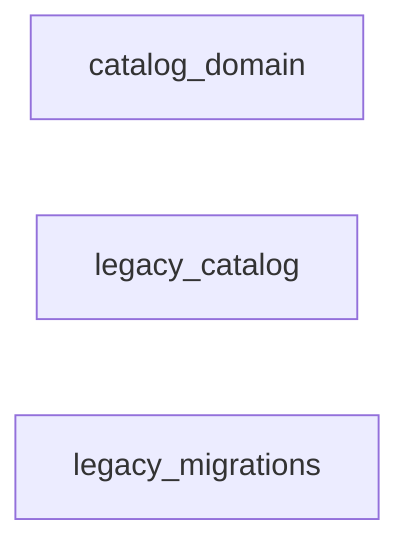
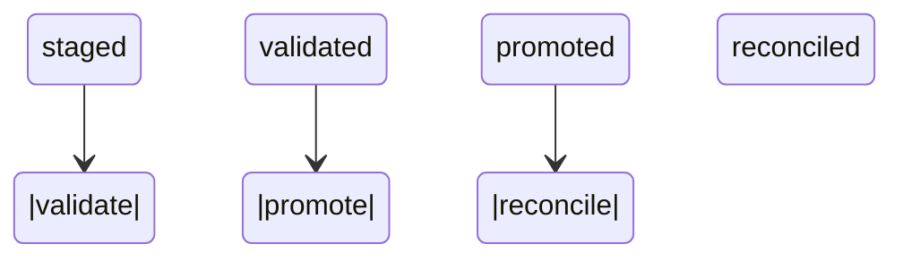
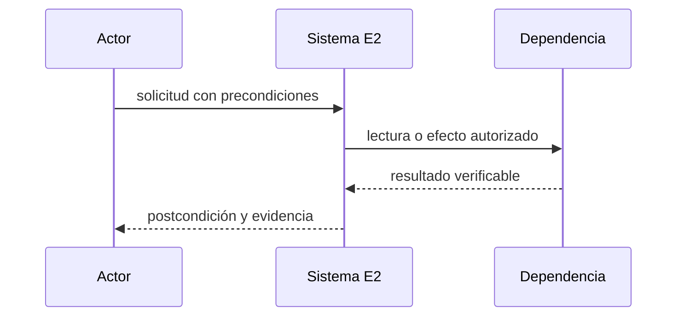
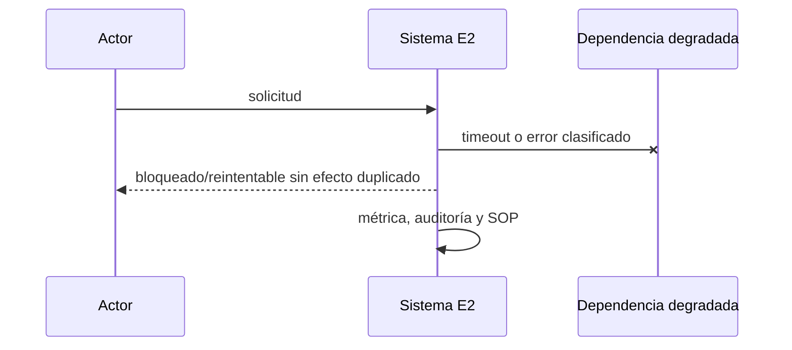

# E2 — Modelo e importación del catálogo canónico

**Estado:** observada (no aceptada: ventana de 7 días en curso, 4 de 7 al 2026-09-23; ver `plan-maestro.md`). Tramo 1 (modelos y variantes) desplegado en producción el 2026-09-20; **tramo 2 (atributos, imágenes y datos comerciales) desplegado en producción el 2026-09-20** (migración `0014`, worker recreado, backfill de las 12.850 representaciones ejecutado; la comparación entre canales se encendió el mismo día, `CATALOGO_COMPARAR_ATRIBUTOS=1`); **tramo 3 (taxonomía propia, marcas, colecciones, packs y kits) desplegado en producción el 2026-09-20** (migración `0015` aplicada, 15 migraciones registradas, 12 tablas nuevas con `SELECT/INSERT/UPDATE` y sin DELETE, los dos triggers instalados, worker recreado con arranque limpio y los datos del tramo 2 intactos): migración verificada contra el contrato, las 8 tareas del plan cerradas (`docs/superpowers/plans/2026-09-20-e2-tramo3-taxonomia-colecciones-packs.md`) y las cuatro decisiones D1–D4 tomadas por José con la jerarquía real a la vista.

**Partición de E2 redefinida el 2026-09-20 por José:** el diseño de T1 había previsto T2 «taxonomía, marcas, colecciones y atributos» y T3 «imágenes y packs/kits». El corte nuevo separa *capturar lo que el canal ya nos dio y hoy se descarta* (T2: atributos, imágenes, precio, stock, GTIN, marca) de *decidir estructura propia de Fusion* (T3: taxonomía, colecciones, packs). Motivo: lo primero no necesita ninguna decisión de negocio ni una llamada extra al canal; lo segundo exige definir una taxonomía que no existe en ninguna parte — `producto_fusion_atributos` y `categorias_criticas` están **vacías** en el legado. Diseño en `specs/2026-09-20-e2-tramo2-atributos-imagenes-design.md`.

**Dependencias:** E1

**Responsable operativo:** José

**Responsable técnico:** asistente

**Fuente canónica:** `docs/superpowers/plan-maestro.md`

## Resultado y límites

- Catálogo relacional completo importado y reconciliado sin escritores remotos.
- **Incluye:** Modelos, variantes vendibles, cuentas, claves externas, taxonomía, atributos, unidades, imágenes, overlays reservados, GTIN como evidencia y composiciones de packs/kits.
- **No incluye:** No activa matcher, UI ni cambios en Woo/ML.
- **Evidencia histórica absorbida:** P2.1, P2.2, UM1.3 modelo, E9 familias. Es evidencia, no aceptación automática.

## Línea base verificada

- catalogo_cache tiene 5.170 filas; Woo padre variable no es vendible; existen datos legacy parciales de familias e identidad.
- Fotografía común: `docs/superpowers/audit-baseline-2026-09-13.md`. Al iniciar se debe refrescar con los mismos comandos y registrar fecha, commit y origen.
- Toda diferencia entre Git, despliegue y base se registra como hallazgo bloqueante; no se rellena por inferencia.

## Decisiones e invariantes

- PostgreSQL es destino canónico; cambios de negocio son transaccionales, auditados y atribuibles.
- Ningún efecto remoto se considera exitoso hasta releer y verificar el recurso; respuesta incierta bloquea repetición ciega.
- Un solo escritor remoto por vertical; idempotencia, versión esperada, leases y DLQ son obligatorios.
- No inferir identidad por nombre o GTIN; nulos y duplicados se convierten en casos, nunca se descartan.

## Diseño, datos e interfaces

- **Modelo:** product_models, sellable_variants, external_representations, identifiers, categories, brands, collections, attributes, attribute_values, media_assets y bundle_versions con FKs, vigencia y archivo.
- **Interfaces:** GET /api/v2/catalog/models, /variants y /reconciliation; lectura paginada con filtros y errores estables.
- Los endpoints nuevos viven bajo `/api/v2`, usan errores `{code,message,correlation_id,details?}`, autorización por capacidad y paginación por cursor.
- Las mutaciones requieren `Idempotency-Key`; las actualizaciones concurrentes requieren `expected_version` y responden 409 sin efecto parcial.
- Eventos/auditoría son append-only; correcciones agregan un evento compensatorio y nunca reescriben historia.

## Integraciones, migración y recuperación

- **Migración:** Snapshot SQLite/Woo/ML, staging, hashes, crosswalk por entidad, rechazo explícito y repetición idempotente antes del delta final.
- ML/Woo se releen desde origen; los cursores tienen solape, deduplicación y cobertura observable. Límites de la API se documentan con fuente oficial y fecha.
- Fallos 403/408/429/5xx usan clasificación estable, backoff con jitter, límite de intentos y DLQ visible.
- El rollback vuelve consumidores o UI a sombra/read-only; no deshace efectos remotos confirmados y usa comandos compensatorios cuando corresponda.

## UI, operación y observabilidad

- Toda UI cubre cargando, vacío, degradado, error recuperable, conflicto y sólo lectura; web cumple 390/768/1440 y WCAG 2.2 AA.
- La App conserva contrato v1 mediante fachada mientras migra por OTA; offline nunca oculta conflictos.
- Métricas mínimas: entradas, procesadas, duplicadas, bloqueadas, reintentos, DLQ, latencia p95/p99, frescura y diferencias de conciliación.
- Cada alerta tiene umbral, canal, responsable, acuse y SOP; ningún `pending` queda fuera del scheduler.

## Pruebas y evidencia

- **Comando contractual:** npm run test:e2; restricciones SQL, importación repetida, padres no vendibles, SKU inmutable y snapshots de packs.
- El comando `npm run test:e2` debe existir antes de pasar a `desarrollo`; no puede ser un alias vacío y debe fallar si falta un escenario obligatorio.
- Registrar salida literal, commit, fixture, fecha, duración y omisiones. Tests existentes sólo cuentan si cubren el contrato nuevo.
- Revisión independiente sin críticos/altos, suite global serial, restauración aplicable y E2E/dispositivo/hardware según superficie.

## Rollout, rollback y aceptación

- **Despliegue:** Sólo lectura; comparar conteos, relaciones y hashes durante 7 días; rollback deshabilitando API v2 y conservando esquema.
- Todo corte de autoridad dura <15 minutos, comienza con backup/restauración vigentes y se aborta ante discrepancia crítica, doble escritor, cola ciega o disco fuera de umbral.
- **Aceptación técnica y operativa:** 100 % del universo clasificado como importado o rechazado con causa; crosswalk íntegro y conciliación firmada.
- Código construido pero no usado no cuenta como observado; publicación no equivale a aceptación.

## Continuidad

- **Próxima acción exacta:** cargar el árbol propio con José. Es la primera corrida operativa del tramo y la única cosa que le falta para dar valor: las tablas están y **vacías**. El orden es: importar las categorías de Woo como evidencia (`node scripts/catalogo-categorias-importar.mjs --cuenta <id>`, arranca en dry-run), correr el informe (`node scripts/catalogo-informe-taxonomia.mjs --empresa <id> --cuenta <id>`, sólo lectura), y con eso a la vista decidir los nodos concretos del árbol por tipo de bici.
- **Verificado en el despliegue:** las dos suites completas en serie y verdes antes de desplegar (plataforma 558/558 en 59 archivos; legado 2.755 pasados y 51 salteados en 156 archivos). Después del despliegue: 15 migraciones, permisos heredados del `ALTER DEFAULT PRIVILEGES` de 0013 sin DELETE en ninguna de las 12 tablas nuevas, `taxonomy_node_versions_sin_ciclos` y `pack_components_valido` instalados, bootstrap reconociendo `terminada` en las dos cuentas sin llamadas nuevas a ML.
- **Lo que el tramo 3 dejó en sombra y todavía no tiene datos:** el árbol propio está implementado pero **vacío**. La jerarquía de Woo se importa como evidencia (`catalog.channel_categories`), y el árbol propio se diseña de cero y se mapea contra ella (decisión D1): esa carga inicial es la primera corrida operativa, no código pendiente.
- **Las cuatro decisiones de D1–D4** quedaron en la sección «Decisiones cerradas por José» del plan, con la evidencia cruda de la jerarquía en `docs/superpowers/specs/e2/woo-categorias-2026-09-20.md`. Lo más importante para quien siga: los «solapamientos» que motivaban D3 **no existían** — eran padre e hijo, aplanados por nuestra propia importación.
- **Los ~4.700 casos de identidad abiertos** que el bootstrap destapó (2.227 `omitida_revisar`, 1.991 `sku_pendiente`, 422 `user_product_divergente`, 49 `woo_sku_no_canonico`, 17 `sku_inexistente_en_woo`, 14 `identidad_legado`) siguen sin atender: son decisiones de negocio pendientes, no fallas, y caen en el territorio de E3.
- **Tramo 1 en producción (2026-09-20):** las 14 tareas del [plan](../plans/2026-09-18-e2-tramo1-modelos-variantes.md) hechas, incluida la tarea 14 (puesta en producción) con sus 9 pasos: migración `0013_catalogo.sql` (esquema `catalog`, 9 tablas), outbox del legado (migración 108) con captura y despachador firmando con el keyring de la sombra, copia inicial de 5.207 decisiones del matcher, proyector con canario de 100 (100 aplicados, 0 rechazados), bootstrap completo de las dos cuentas (Woo 21 páginas / 5.235 recursos; ML 42 páginas / 4.050 ítems) y conciliación diaria a las 03:30 ART. Resultado: **4.053 modelos, 6.946 variantes, 12.849 representaciones, 10.699 mensajes procesados, 1 solo en DLQ** (un producto en la papelera de Woo, rechazo correcto que protege el archivo). La conciliación automática del 2026-09-20 a las 06:30 UTC dio el matcher en `sinCambios: 5207`: cero deriva entre legado y plataforma.
- **Defectos reales que el despliegue destapó y se corrigieron:** `compose.yml` nunca declaraba las variables `CATALOGO_*`, así que el catálogo era inencendible en producción pese a estar implementado y testeado (`b9851e3`); Docker Compose interpola una variable inexistente como cadena vacía y el esquema zod la rechaza como inválida, no como ausente, de modo que un flag apagado tumbaba el worker (arreglado en `cargarConfig` con `sinVacias`); el bootstrap de Woo pedía una ruta que el gateway rechaza antes de red (`c9ea2cd`); y el bootstrap cedía ante los 429 de ML con una espera fija de 60 s, sin backoff y descartando el `Retry-After` que el cliente ya parseaba (`9ede20c`, `1684559`).
- Esta ficha queda bloqueada si contiene decisiones abiertas, cifras sin consulta reproducible, interfaces supuestas o rollback genérico.
- No registrar secretos, tokens, PII, volcados de producción ni razonamiento privado.


## Vista de arquitectura de la entrega



| Componente | Estado | Ruta | Responsabilidad |
|---|---|---|---|
| catalog_domain | future | plataforma/src/catalog | modelo canónico |
| legacy_catalog | existing | lib/identidadProductos.js | evidencia reutilizable |
| legacy_migrations | existing | migrations/082_identidad_productos.sql | crosswalk, no esquema objetivo |

## Actores, tecnologías y dependencias externas

- **Actores:** catalogo, importador, revisor_catalogo.
- **Tecnologías:** PostgreSQL 18, TypeScript strict, SQL migrations expand/contract, GS1 GTIN-14 canonical form.

| Servicio | Estado | Finalidad |
|---|---|---|
| WooCommerce REST API | required | snapshot productos/variaciones |
| Mercado Libre API | required | snapshot publicaciones/variaciones |
| servicio de imágenes | discarded | no agregar CDN nuevo en E2 |

Un servicio `candidate` no autoriza contratación, instalación ni uso de credenciales.

## Casos de uso y guía operativa

| ID | Actor | Precondición | Disparador | Flujo principal | Alternativas | Errores | Postcondición | Prueba | Evidencia |
|---|---|---|---|---|---|---|---|---|---|
| E2-UC1 | importador | snapshots fechados y hasheados | import run | staging, validar, promover y reconciliar | fila ambigua pasa a rechazo | FK/unique aborta lote atómico | 100% importado o rechazado | E2-IMP-01 | crosswalk y reporte firmado |
| E2-UC2 | revisor_catalogo | run reconciliado | consulta | navegar modelo, variantes, externos, GTIN y kits | dato ausente visible | sin permisos 403 | sin escrituras remotas | E2-SQL-01 | captura y query reproducible |

La guía operativa para cada caso es: verificar precondiciones; registrar commit, actor y hora; ejecutar
el flujo sin saltar guardas; ante una alternativa seguir su rama; ante error detener ampliación,
preservar evidencia y aplicar el SOP; comprobar postcondición y adjuntar la evidencia indicada.

## Modelo relacional detallado

| Entidad | PK | Restricciones | Índices | Dueño | Retención | PII |
|---|---|---|---|---|---|---|
| product_models | id | archivable; no vendible | brand_id, category_id | catalog | permanente | none |
| sellable_variants | id | fusion_sku unique immutable; model FK | model_id, status | catalog | permanente | none |
| external_representations | id | channel+account+external key unique | variant_id | catalog | auditable | none |
| identifiers | id | canonical value unique while active; provenance required | variant_id, canonical_value | catalog | history retained | none |
| bundle_versions | id | dated composition; positive quantities; no cycles | bundle_variant_id, valid_from | catalog | permanente | none |
| import_rejections | id | source hash and reason required | run_id, reason | migration | hasta cierre+archivo | none |

Las entidades objetivo son `future`: su nombre y contrato quedan fijados para el diseño, pero ninguna
tabla se declara existente hasta observar su migración aplicada y consultar su esquema.

## Máquina de estados y transiciones



| Desde | Evento | Guarda | Hasta | Efecto | Error | Prueba |
|---|---|---|---|---|---|---|
| staged | validate | shape and provenance valid | validated | crosswalk candidate | rejected | E2-IMP-01 |
| validated | promote | constraints and identity non-inferred | promoted | transactional upsert | rollback transaction | E2-IMP-02 |
| promoted | reconcile | counts+hashes+relations | reconciled | signed report | blocked | E2-IMP-03 |

## Secuencias normal, degradada e incierta





```mermaid
sequenceDiagram
  participant W as Worker
  participant D as Dependencia remota
  W->>D: operación idempotente
  D--xW: respuesta perdida
  W->>W: estado uncertain; no repetir
  W->>D: GET de reconciliación
  D-->>W: estado observado
  W->>W: confirmar o compensar
```

## Contratos API

| Método | Ruta | Autenticación | Entrada | Salida | Errores | Idempotencia | Concurrencia |
|---|---|---|---|---|---|---|---|
| GET | /api/v2/catalog/models | catalog.read | cursor+filters | paged models | 401/403/422 | n/a | stable cursor |
| GET | /api/v2/catalog/variants | catalog.read | cursor+sku+identifier | paged variants | 401/403/422 | n/a | stable cursor |
| GET | /api/v2/catalog/reconciliation | catalog.audit | run_id | counts, hashes, rejects | 401/403/404 | n/a | immutable run |

## Fallos, recuperación y SOP

- padre variable nunca vendible
- GTIN no auto-vincula
- SKU no se reutiliza
- kit cíclico rechazado
- reimportación no duplica
- rechazos nunca se descartan

El SOP común es: congelar ampliación; conservar payloads redactados, hashes y correlation ID; comprobar
fuente remota sin escribir; clasificar retryable/uncertain/terminal; reparar mediante replay idempotente
o compensación; demostrar conciliación; sólo entonces reanudar.

## Integraciones, observabilidad, rollout y rollback

- **Integración:** Woo/ML: snapshots paginados de sólo lectura con fecha y hash
- **Integración:** staging: carga repetible sin promover filas rechazadas
- **Observación:** importados/rechazados por causa
- **Observación:** FK/duplicados
- **Observación:** hashes y duración por run
- **Rollout:** lectura y reconciliación siete días sin escritores remotos
- **Rollback:** deshabilitar API v2 y conservar staging/esquema para auditoría

## Plan de implementación por cortes revisables

1. Congelar línea base, fuentes y fixture sin PII; commit sólo documental/evidencia.
2. Crear migraciones y restricciones con pruebas fallando; commit de esquema aislado.
3. Implementar dominio y máquinas de estado sin efectos remotos; commit unitario.
4. Añadir contratos, adaptadores y simulador; commit de integración.
5. Añadir UI/SOP/observabilidad y pruebas contractuales; commit operable.
6. Ensayar sombra, canario, aborto y rollback; adjuntar evidencia sin mezclar cambios.

## Matriz de trazabilidad

| Requisito | Diseño | Archivo | Migración | Prueba | Métrica | Evidencia |
|---|---|---|---|---|---|---|
| 100% clasificado | entidades/transiciones/API de esta ficha | plataforma/src/catalog | migración E2 aún no creada | E2-IMP-01 | 100% clasificado | salida literal + commit + fecha |
| importación repetible | entidades/transiciones/API de esta ficha | plataforma/src/catalog | migración E2 aún no creada | E2-IMP-02 | importación repetible | salida literal + commit + fecha |
| crosswalk íntegro | entidades/transiciones/API de esta ficha | plataforma/src/catalog | migración E2 aún no creada | E2-IMP-03 | crosswalk íntegro | salida literal + commit + fecha |
| 0 escritura remota | entidades/transiciones/API de esta ficha | plataforma/src/catalog | migración E2 aún no creada | E2-SQL-01 | 0 escritura remota | salida literal + commit + fecha |

## Fuentes y decisiones abiertas

- https://www.gs1.org/standards/id-keys/gtin — consultada 2026-09-13.

**Decisiones abiertas que mantienen la ficha en borrador:** taxonomía inicial; retención de imágenes originales; estrategia de búsqueda PostgreSQL.

## Decisiones PM asignadas

- **Dueña:** PM-029, PM-031, PM-033, PM-040, PM-044, PM-045, PM-054, PM-060, PM-062, PM-063, PM-064, PM-065, PM-066, PM-067, PM-068, PM-069, PM-070, PM-071, PM-072, PM-078, PM-080, PM-081, PM-082, PM-096, PM-103, PM-106, PM-107, PM-108, PM-110, PM-114, PM-119, PM-120, PM-122, PM-130, PM-132, PM-133, PM-144, PM-145, PM-150, PM-151, PM-164
- **Consumidora:** PM-004, PM-032, PM-034, PM-046, PM-048, PM-049, PM-055, PM-059, PM-073, PM-074, PM-075, PM-076, PM-083, PM-084, PM-087, PM-089, PM-090, PM-092, PM-093, PM-094, PM-095, PM-097, PM-098, PM-099, PM-101, PM-105, PM-111, PM-113, PM-115, PM-117, PM-121, PM-123, PM-124, PM-125, PM-126, PM-128, PM-129, PM-131, PM-134, PM-135, PM-136, PM-139, PM-140, PM-141, PM-142, PM-143, PM-148, PM-149, PM-153, PM-154, PM-156, PM-158, PM-159, PM-160
