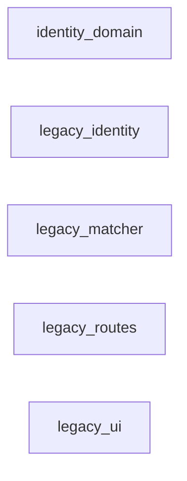
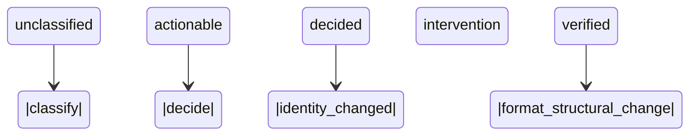
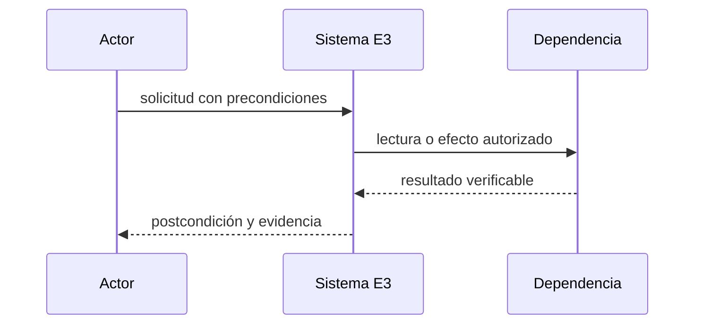
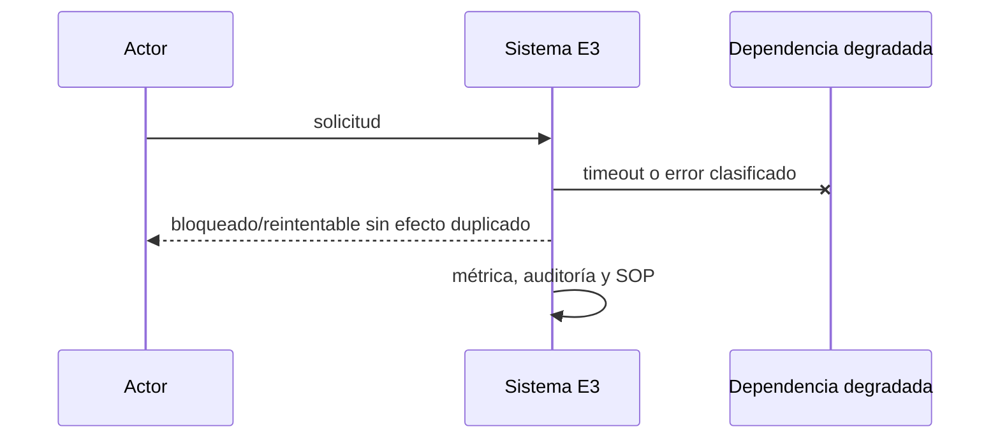

# E3 — Identidad y matcher único en sombra

**Estado:** desarrollo (corte 1 con primeras corridas en producción el 2026-09-24 según evidencia, corte 3 en construcción; ver `plan-maestro.md`)

**Dependencias:** E2

**Responsable operativo:** José

**Responsable técnico:** asistente

**Fuente canónica:** `docs/superpowers/plan-maestro.md`

## Resultado y límites

- Un solo motor explica y registra identidades y casos, con UI v2, simulación y decisiones en sombra.
- **Incluye:** Auto-vínculo sólo por seller_sku exacto único; sugerencias explicables; decisiones humanas versionadas; alerta SKU y pausa por cambio de producto/formato/pack.
- **No incluye:** No ejecuta comandos reales ni corrige los 39 SKU.
- **Evidencia histórica absorbida:** P2.3–P2.6, UM1.1–UM1.5, Matcher, Cobertura, Guardia ML, vigía de formato. Es evidencia, no aceptación automática.

## Línea base verificada

- 1.055 verificadas, 11 esperando operación, 0 urgentes y 0 conflictos user_product al snapshot; el código legacy es evidencia, no aceptación.
- Fotografía común: `docs/superpowers/audit-baseline-2026-09-13.md`. Al iniciar se debe refrescar con los mismos comandos y registrar fecha, commit y origen.
- Toda diferencia entre Git, despliegue y base se registra como hallazgo bloqueante; no se rellena por inferencia.

## Decisiones e invariantes

- PostgreSQL es destino canónico; cambios de negocio son transaccionales, auditados y atribuibles.
- Ningún efecto remoto se considera exitoso hasta releer y verificar el recurso; respuesta incierta bloquea repetición ciega.
- Un solo escritor remoto por vertical; idempotencia, versión esperada, leases y DLQ son obligatorios.
- GTIN nunca auto-vincula. Un cambio de seller_sku confirmado alerta sin reasignar; un cambio estructural pausa de forma durable.

## Diseño, datos e interfaces

- **Modelo:** identity_cases, identity_decisions, identity_evidence, identity_candidates, format_observations y comandos parked; una decisión vigente por clave.
- **Interfaces:** API v2 de casos, candidatos, decisión, historial y simulación; mutaciones con expected_version, idempotency-key, roles catálogo/administración y 409 en conflicto.
- Los endpoints nuevos viven bajo `/api/v2`, usan errores `{code,message,correlation_id,details?}`, autorización por capacidad y paginación por cursor.
- Las mutaciones requieren `Idempotency-Key`; las actualizaciones concurrentes requieren `expected_version` y responden 409 sin efecto parcial.
- Eventos/auditoría son append-only; correcciones agregan un evento compensatorio y nunca reescriben historia.

## Integraciones, migración y recuperación

- **Migración:** Importar sólo SKU exacto único o decisión humana unívoca; contradicciones y objetivos cambiantes vuelven a revisión.
- ML/Woo se releen desde origen; los cursores tienen solape, deduplicación y cobertura observable. Límites de la API se documentan con fuente oficial y fecha.
- Fallos 403/408/429/5xx usan clasificación estable, backoff con jitter, límite de intentos y DLQ visible.
- El rollback vuelve consumidores o UI a sombra/read-only; no deshace efectos remotos confirmados y usa comandos compensatorios cuando corresponda.

## UI, operación y observabilidad

- Toda UI cubre cargando, vacío, degradado, error recuperable, conflicto y sólo lectura; web cumple 390/768/1440 y WCAG 2.2 AA.
- La App conserva contrato v1 mediante fachada mientras migra por OTA; offline nunca oculta conflictos.
- Métricas mínimas: entradas, procesadas, duplicadas, bloqueadas, reintentos, DLQ, latencia p95/p99, frescura y diferencias de conciliación.
- Cada alerta tiene umbral, canal, responsable, acuse y SOP; ningún `pending` queda fuera del scheduler.

## Pruebas y evidencia

- **Comando contractual:** npm run test:e3; calibración ≥200 casos, concurrencia de dos operadores, duplicados/desorden, 403/408/429/5xx y E2E 390/768/1440 WCAG 2.2 AA.
- El comando `npm run test:e3` debe existir antes de pasar a `desarrollo`; no puede ser un alias vacío y debe fallar si falta un escenario obligatorio.
- Registrar salida literal, commit, fixture, fecha, duración y omisiones. Tests existentes sólo cuentan si cubren el contrato nuevo.
- Revisión independiente sin críticos/altos, suite global serial, restauración aplicable y E2E/dispositivo/hardware según superficie.

## Rollout, rollback y aceptación

- **Despliegue:** Sombra ≥7 días, comandos contra simulador, canario por cuenta preparado pero sin escritor real.
- Todo corte de autoridad dura <15 minutos, comienza con backup/restauración vigentes y se aborta ante discrepancia crítica, doble escritor, cola ciega o disco fuera de umbral.
- **Aceptación técnica y operativa:** Decisiones iguales al comportamiento aprobado o diferencia explicada; 0 decisiones contradictorias; UI y auditoría completas.
- Código construido pero no usado no cuenta como observado; publicación no equivale a aceptación.

## Continuidad

- **Próxima acción exacta:** Congelar fixture de calibración y redactar OpenAPI/máquinas de estado antes de implementar.
- Esta ficha queda bloqueada si contiene decisiones abiertas, cifras sin consulta reproducible, interfaces supuestas o rollback genérico.
- No registrar secretos, tokens, PII, volcados de producción ni razonamiento privado.


## Vista de arquitectura de la entrega



| Componente | Estado | Ruta | Responsabilidad |
|---|---|---|---|
| identity_domain | future | plataforma/src/identity | única autoridad de matching/casos |
| legacy_identity | existing | lib/identidadProductos.js | evidencia |
| legacy_matcher | existing | lib/matcherEngine.js | algoritmos a recalibrar |
| legacy_routes | existing | routes/identidadProductos.js | mapa de compatibilidad |
| legacy_ui | existing | public/identidad-productos | evidencia UX |

## Actores, tecnologías y dependencias externas

- **Actores:** operador_catalogo, administrador, matcher, simulador.
- **Tecnologías:** PostgreSQL 18, TypeScript strict, Express/API v2, Mermaid, axe-core, Playwright.

| Servicio | Estado | Finalidad |
|---|---|---|
| Mercado Libre API | required | relectura de publicación antes de clasificar |
| WooCommerce REST API | required | relectura de variante/candidato |
| servicio ML externo adicional | discarded | no delegar identidad fuera del núcleo |

Un servicio `candidate` no autoriza contratación, instalación ni uso de credenciales.

## Casos de uso y guía operativa

| ID | Actor | Precondición | Disparador | Flujo principal | Alternativas | Errores | Postcondición | Prueba | Evidencia |
|---|---|---|---|---|---|---|---|---|---|
| E3-UC1 | matcher | observaciones frescas | barrido/webhook | clasificar, puntuar y explicar candidatos | seller_sku exacto único auto-verifica | GTIN contradictorio crea intervención | caso reproducible | E3-SM-01 | engine_version+hashes |
| E3-UC2 | operador_catalogo | caso actionable | abrir detalle | comparar ML/Woo, buscar, previsualizar y decidir | tomar nota o excluir con permiso | 409 refresca sin sobrescribir | decisión append-only y comando parked | E3-SM-02 | actor, motivo, antes/después |

La guía operativa para cada caso es: verificar precondiciones; registrar commit, actor y hora; ejecutar
el flujo sin saltar guardas; ante una alternativa seguir su rama; ante error detener ampliación,
preservar evidencia y aplicar el SOP; comprobar postcondición y adjuntar la evidencia indicada.

## Modelo relacional detallado

| Entidad | PK | Restricciones | Índices | Dueño | Retención | PII |
|---|---|---|---|---|---|---|
| identity_cases | id | account+ML key unique vigente; version | state,severity,updated_at | identity | permanente | none |
| identity_decisions | id | actor, reason, expected_version; append-only | case_id,created_at | identity | permanente | actor reference |
| identity_evidence | id | source, observed_at, hash | case_id,source | identity | permanente | none |
| identity_candidates | case+variant | score+explanation+engine_version | case_id,rank | identity | por run | none |
| format_observations | ML key+version | remote hash and structural fields | observed_at | identity | auditable | none |

Las entidades objetivo son `future`: su nombre y contrato quedan fijados para el diseño, pero ninguna
tabla se declara existente hasta observar su migración aplicada y consultar su esquema.

## Máquina de estados y transiciones



| Desde | Evento | Guarda | Hasta | Efecto | Error | Prueba |
|---|---|---|---|---|---|---|
| unclassified | classify | ML/Woo fresh | actionable | evidence+candidates | parked | E3-SM-01 |
| actionable | decide | capability+expected_version | decided | append decision; parked command | 409 | E3-SM-02 |
| decided | identity_changed | fingerprint differs | intervention | invalidate prior assumption | none | E3-SM-03 |
| verified | format_structural_change | product/format/pack differs | intervention | park pause command | alert | E3-SM-04 |

## Secuencias normal, degradada e incierta





```mermaid
sequenceDiagram
  participant W as Worker
  participant D as Dependencia remota
  W->>D: operación idempotente
  D--xW: respuesta perdida
  W->>W: estado uncertain; no repetir
  W->>D: GET de reconciliación
  D-->>W: estado observado
  W->>W: confirmar o compensar
```

## Contratos API

| Método | Ruta | Autenticación | Entrada | Salida | Errores | Idempotencia | Concurrencia |
|---|---|---|---|---|---|---|---|
| GET | /api/v2/identity/cases | identity.read | cursor,state,severity | paged cases | 401/403/422 | n/a | stable cursor |
| GET | /api/v2/identity/cases/{id} | identity.read | id | case,evidence,candidates,history | 401/403/404 | n/a | version returned |
| POST | /api/v2/identity/cases/{id}/decisions | identity.write | choice,variant_id,reason,expected_version | decision,new_version,parked_command | 401/403/404/409/422 | Idempotency-Key | optimistic |

## Fallos, recuperación y SOP

- webhook falso no se confía
- relectura 404 archiva o bloquea según contexto
- GTIN sólo evidencia
- empate no auto-vincula
- cambio seller_sku alerta
- cambio estructural prepara pausa

El SOP común es: congelar ampliación; conservar payloads redactados, hashes y correlation ID; comprobar
fuente remota sin escribir; clasificar retryable/uncertain/terminal; reparar mediante replay idempotente
o compensación; demostrar conciliación; sólo entonces reanudar.

## Integraciones, observabilidad, rollout y rollback

- **Integración:** ML: webhook dispara GET de publicación; payload no es autoridad
- **Integración:** Woo: candidato se confirma con lectura fresca
- **Integración:** simulador: captura comandos parked sin credenciales
- **Observación:** casos por estado/severidad
- **Observación:** precisión calibrada
- **Observación:** 409 concurrentes
- **Observación:** frescura ML/Woo
- **Rollout:** fixture >=200, E2E tres anchos, simulación y siete días sombra
- **Rollback:** UI read-only y consumidor apagado; decisiones/evidencias se conservan

## Plan de implementación por cortes revisables

1. Congelar línea base, fuentes y fixture sin PII; commit sólo documental/evidencia.
2. Crear migraciones y restricciones con pruebas fallando; commit de esquema aislado.
3. Implementar dominio y máquinas de estado sin efectos remotos; commit unitario.
4. Añadir contratos, adaptadores y simulador; commit de integración.
5. Añadir UI/SOP/observabilidad y pruebas contractuales; commit operable.
6. Ensayar sombra, canario, aborto y rollback; adjuntar evidencia sin mezclar cambios.

## Matriz de trazabilidad

| Requisito | Diseño | Archivo | Migración | Prueba | Métrica | Evidencia |
|---|---|---|---|---|---|---|
| >=200 casos calibración | entidades/transiciones/API de esta ficha | plataforma/src/identity | migración E3 aún no creada | E3-SM-01 | >=200 casos calibración | salida literal + commit + fecha |
| WCAG 2.2 AA | entidades/transiciones/API de esta ficha | plataforma/src/identity | migración E3 aún no creada | E3-SM-02 | WCAG 2.2 AA | salida literal + commit + fecha |
| 0 decisiones contradictorias | entidades/transiciones/API de esta ficha | plataforma/src/identity | migración E3 aún no creada | E3-SM-03 | 0 decisiones contradictorias | salida literal + commit + fecha |
| 0 escritura remota | entidades/transiciones/API de esta ficha | plataforma/src/identity | migración E3 aún no creada | E3-SM-04 | 0 escritura remota | salida literal + commit + fecha |

## Fuentes y decisiones abiertas

- https://developers.mercadolibre.com.ar/es_ar/descripcion-de-articulos/seguridad-apps — consultada 2026-09-13.

**Decisiones abiertas que mantienen la ficha en borrador:** umbrales de scoring tras calibración; vocabulario final de causas; SLA operativo por severidad.

## Decisiones PM asignadas

- **Dueña:** PM-037, PM-038, PM-039, PM-042, PM-053, PM-055, PM-057, PM-058, PM-061, PM-075, PM-077, PM-085, PM-087, PM-092, PM-100, PM-116, PM-117, PM-118, PM-124, PM-126, PM-131
- **Consumidora:** PM-004, PM-029, PM-031, PM-032, PM-033, PM-034, PM-040, PM-044, PM-045, PM-046, PM-048, PM-049, PM-054, PM-059, PM-060, PM-064, PM-068, PM-069, PM-070, PM-073, PM-074, PM-076, PM-078, PM-080, PM-081, PM-083, PM-084, PM-089, PM-090, PM-093, PM-094, PM-095, PM-096, PM-097, PM-098, PM-099, PM-101, PM-103, PM-105, PM-106, PM-107, PM-108, PM-110, PM-111, PM-113, PM-114, PM-115, PM-119, PM-120, PM-121, PM-122, PM-123, PM-125, PM-128, PM-129, PM-130, PM-132, PM-133, PM-134, PM-135, PM-136, PM-139, PM-140, PM-141, PM-142, PM-143, PM-144, PM-148, PM-149, PM-150, PM-151, PM-153, PM-154, PM-156, PM-158, PM-159, PM-160, PM-164
