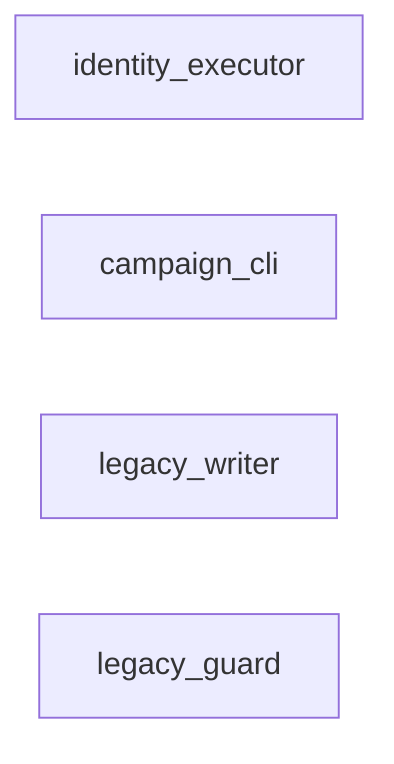
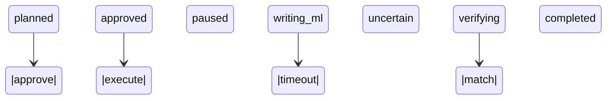
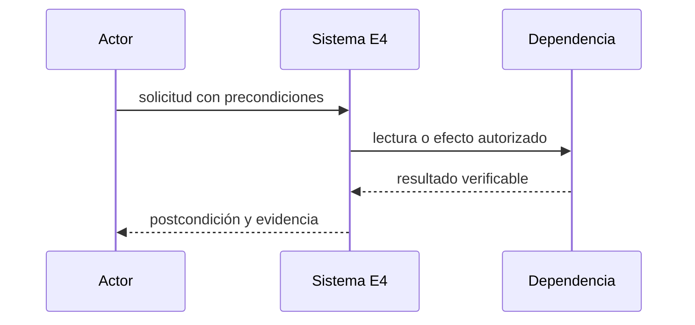
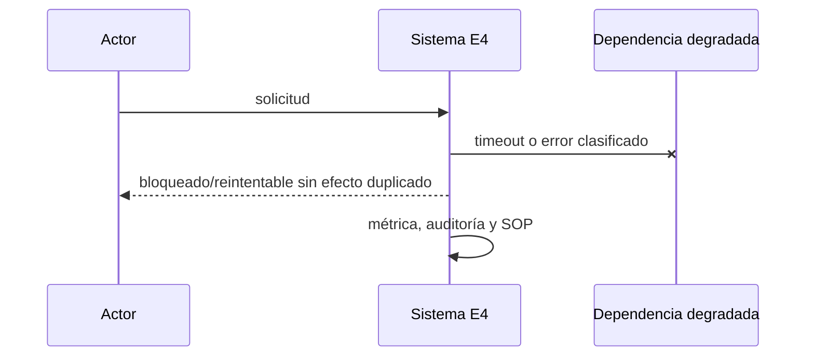

# E4 — Campaña SKU y corte de catálogo/identidad

**Estado:** borrador

**Dependencias:** E3

**Responsable operativo:** José

**Responsable técnico:** asistente

**Fuente canónica:** `docs/superpowers/plan-maestro.md`

## Resultado y límites

- Catálogo e identidad pasan al núcleo con un único ejecutor remoto y rollback probado.
- **Incluye:** Campaña de 39 SKU, duplicados, contradicciones, passkeys reales probadas, canario y apagado de escritores legacy de identidad.
- **No incluye:** Los GTIN sin riesgo comercial migran como casos abiertos y no bloquean.
- **Evidencia histórica absorbida:** P2.7, P2.8, UM1.6. Es evidencia, no aceptación automática.

## Línea base verificada

- 39 vendibles fuera de FB-{ID_WOO}: 5 simples y 34 variaciones al snapshot.
- Fotografía común: `docs/superpowers/audit-baseline-2026-09-13.md`. Al iniciar se debe refrescar con los mismos comandos y registrar fecha, commit y origen.
- Toda diferencia entre Git, despliegue y base se registra como hallazgo bloqueante; no se rellena por inferencia.

## Decisiones e invariantes

- PostgreSQL es destino canónico; cambios de negocio son transaccionales, auditados y atribuibles.
- Ningún efecto remoto se considera exitoso hasta releer y verificar el recurso; respuesta incierta bloquea repetición ciega.
- Un solo escritor remoto por vertical; idempotencia, versión esperada, leases y DLQ son obligatorios.
- Respuesta remota incierta queda bloqueada hasta GET; nunca repetir una escritura sin reconciliar.

## Diseño, datos e interfaces

- **Modelo:** Crosswalk final, comandos de migración y verificaciones remotas append-only; ningún SKU se reutiliza.
- **Interfaces:** Comandos v2 aprobar/pausar/corregir/reanudar con estado consultable; fachada v1 sólo lectura donde sea necesaria.
- Los endpoints nuevos viven bajo `/api/v2`, usan errores `{code,message,correlation_id,details?}`, autorización por capacidad y paginación por cursor.
- Las mutaciones requieren `Idempotency-Key`; las actualizaciones concurrentes requieren `expected_version` y responden 409 sin efecto parcial.
- Eventos/auditoría son append-only; correcciones agregan un evento compensatorio y nunca reescriben historia.

## Integraciones, migración y recuperación

- **Migración:** Pausar, cambiar Woo/ML, verificar, reanudar por lotes pequeños; delta final bajo congelamiento de escritores.
- ML/Woo se releen desde origen; los cursores tienen solape, deduplicación y cobertura observable. Límites de la API se documentan con fuente oficial y fecha.
- Fallos 403/408/429/5xx usan clasificación estable, backoff con jitter, límite de intentos y DLQ visible.
- El rollback vuelve consumidores o UI a sombra/read-only; no deshace efectos remotos confirmados y usa comandos compensatorios cuando corresponda.

## UI, operación y observabilidad

- Toda UI cubre cargando, vacío, degradado, error recuperable, conflicto y sólo lectura; web cumple 390/768/1440 y WCAG 2.2 AA.
- La App conserva contrato v1 mediante fachada mientras migra por OTA; offline nunca oculta conflictos.
- Métricas mínimas: entradas, procesadas, duplicadas, bloqueadas, reintentos, DLQ, latencia p95/p99, frescura y diferencias de conciliación.
- Cada alerta tiene umbral, canal, responsable, acuse y SOP; ningún `pending` queda fuera del scheduler.

## Pruebas y evidencia

- **Comando contractual:** npm run test:e4; simulación completa, passkeys en dispositivos reales, canario y rollback a shadow/read-only.
- El comando `npm run test:e4` debe existir antes de pasar a `desarrollo`; no puede ser un alias vacío y debe fallar si falta un escenario obligatorio.
- Registrar salida literal, commit, fixture, fecha, duración y omisiones. Tests existentes sólo cuentan si cubren el contrato nuevo.
- Revisión independiente sin críticos/altos, suite global serial, restauración aplicable y E2E/dispositivo/hardware según superficie.

## Rollout, rollback y aceptación

- **Despliegue:** Ventana <15 min, lote inicial de 10, ampliación por métricas; abortar ante escritor duplicado o discrepancia crítica.
- Todo corte de autoridad dura <15 minutos, comienza con backup/restauración vigentes y se aborta ante discrepancia crítica, doble escritor, cola ciega o disco fuera de umbral.
- **Aceptación técnica y operativa:** Un solo ejecutor, 39 SKU reconciliados, GTIN riesgosos resueltos y jornada observada aceptada.
- Código construido pero no usado no cuenta como observado; publicación no equivale a aceptación.

## Continuidad

- **Próxima acción exacta:** Crear runbook de campaña y seleccionar canario sin ventas activas conflictivas.
- Esta ficha queda bloqueada si contiene decisiones abiertas, cifras sin consulta reproducible, interfaces supuestas o rollback genérico.
- No registrar secretos, tokens, PII, volcados de producción ni razonamiento privado.


## Vista de arquitectura de la entrega



| Componente | Estado | Ruta | Responsabilidad |
|---|---|---|---|
| identity_executor | future | plataforma/src/identity/worker | único escritor remoto |
| campaign_cli | future | plataforma/scripts/e4-campaign.ts | runbook reproducible |
| legacy_writer | existing | lib/identidadMl.js | apagar tras corte |
| legacy_guard | existing | lib/guardiaMl.js | apagar mutaciones tras corte |

## Actores, tecnologías y dependencias externas

- **Actores:** administrador, ejecutor_remoto, jose_aprobador, mercado_libre, woocommerce.
- **Tecnologías:** PostgreSQL 18, TypeScript strict, WebAuthn/passkeys reales, ML API, Woo REST API.

| Servicio | Estado | Finalidad |
|---|---|---|
| Mercado Libre API | required | SKU/pausa/relectura |
| WooCommerce REST API | required | SKU/relectura |
| dispositivos passkey de José | required | aceptación autenticación real |

Un servicio `candidate` no autoriza contratación, instalación ni uso de credenciales.

## Casos de uso y guía operativa

| ID | Actor | Precondición | Disparador | Flujo principal | Alternativas | Errores | Postcondición | Prueba | Evidencia |
|---|---|---|---|---|---|---|---|---|---|
| E4-UC1 | administrador | 39 casos conciliados y simulados | campaña aprobada | congelar scope, canario, lotes, verificar y ampliar | caso GTIN no vendedor queda abierto | writer duplicado o discrepancia aborta | SKU reconciliados | E4-CUT-01 | acta y hashes |
| E4-UC2 | ejecutor_remoto | comando claimed | worker | releer, escribir sólo si necesario, releer y confirmar | ya coincide completa sin PUT | timeout pasa uncertain | efecto confirmado o bloqueado | E4-SM-03 | request/response redacted hashes |

La guía operativa para cada caso es: verificar precondiciones; registrar commit, actor y hora; ejecutar
el flujo sin saltar guardas; ante una alternativa seguir su rama; ante error detener ampliación,
preservar evidencia y aplicar el SOP; comprobar postcondición y adjuntar la evidencia indicada.

## Modelo relacional detallado

| Entidad | PK | Restricciones | Índices | Dueño | Retención | PII |
|---|---|---|---|---|---|---|
| migration_campaigns | id | scope hash, approver, status | status,created_at | identity | permanente | actor reference |
| remote_commands | id | idempotency unique; expected evidence | state,available_at | integrations | permanente | none |
| remote_attempts | id | command FK; request/response hashes | command_id,started_at | integrations | permanente | redacted |

Las entidades objetivo son `future`: su nombre y contrato quedan fijados para el diseño, pero ninguna
tabla se declara existente hasta observar su migración aplicada y consultar su esquema.

## Máquina de estados y transiciones



| Desde | Evento | Guarda | Hasta | Efecto | Error | Prueba |
|---|---|---|---|---|---|---|
| planned | approve | passkey reciente+scope hash | approved | freeze target | 403/409 | E4-SM-01 |
| approved | execute | canary/lote habilitado | paused | pausa si riesgo requiere | blocked | E4-SM-02 |
| writing_ml | timeout | resultado desconocido | uncertain | sólo GET posterior | no repetir PUT | E4-SM-03 |
| verifying | match | Woo/ML objetivo confirmado | completed | reanuda si corresponde | compensating | E4-SM-04 |

## Secuencias normal, degradada e incierta





```mermaid
sequenceDiagram
  participant W as Worker
  participant D as Dependencia remota
  W->>D: operación idempotente
  D--xW: respuesta perdida
  W->>W: estado uncertain; no repetir
  W->>D: GET de reconciliación
  D-->>W: estado observado
  W->>W: confirmar o compensar
```

## Contratos API

| Método | Ruta | Autenticación | Entrada | Salida | Errores | Idempotencia | Concurrencia |
|---|---|---|---|---|---|---|---|
| POST | /api/v2/identity/campaigns | identity.admin+recent passkey | case_ids,scope_hash | campaign planned | 401/403/409/422 | Idempotency-Key | scope lock |
| POST | /api/v2/identity/campaigns/{id}/approve | identity.admin+recent passkey | expected_version | approved campaign | 401/403/409/422 | Idempotency-Key | optimistic |
| GET | /api/v2/identity/commands/{id} | identity.read | id | state,attempts,evidence | 401/403/404 | n/a | snapshot |

## Fallos, recuperación y SOP

- respuesta incierta nunca se repite ciegamente
- 403 bloquea campaña
- 429/5xx conservan orden y backoff
- escritor legacy detectado aborta
- efecto confirmado se compensa, no se borra

El SOP común es: congelar ampliación; conservar payloads redactados, hashes y correlation ID; comprobar
fuente remota sin escribir; clasificar retryable/uncertain/terminal; reparar mediante replay idempotente
o compensación; demostrar conciliación; sólo entonces reanudar.

## Integraciones, observabilidad, rollout y rollback

- **Integración:** ML/Woo: GET antes y después de PUT
- **Integración:** passkeys: reautenticación reciente
- **Integración:** legacy: flags prueban un solo escritor
- **Observación:** comandos por estado
- **Observación:** latencia/cuota remota
- **Observación:** writer duplicado
- **Observación:** diferencias SKU
- **Observación:** duración del corte
- **Rollout:** simulador, canario aprobado, lote pequeño, corte menor a 15m y ampliación por métricas
- **Rollback:** volver a shadow/read-only; compensar efectos confirmados y reconciliar inciertos

## Plan de implementación por cortes revisables

1. Congelar línea base, fuentes y fixture sin PII; commit sólo documental/evidencia.
2. Crear migraciones y restricciones con pruebas fallando; commit de esquema aislado.
3. Implementar dominio y máquinas de estado sin efectos remotos; commit unitario.
4. Añadir contratos, adaptadores y simulador; commit de integración.
5. Añadir UI/SOP/observabilidad y pruebas contractuales; commit operable.
6. Ensayar sombra, canario, aborto y rollback; adjuntar evidencia sin mezclar cambios.

## Matriz de trazabilidad

| Requisito | Diseño | Archivo | Migración | Prueba | Métrica | Evidencia |
|---|---|---|---|---|---|---|
| 39 SKU conciliados | entidades/transiciones/API de esta ficha | plataforma/src/identity/worker | migración E4 aún no creada | E4-SM-01 | 39 SKU conciliados | salida literal + commit + fecha |
| corte<15m | entidades/transiciones/API de esta ficha | plataforma/src/identity/worker | migración E4 aún no creada | E4-SM-02 | corte<15m | salida literal + commit + fecha |
| un escritor | entidades/transiciones/API de esta ficha | plataforma/src/identity/worker | migración E4 aún no creada | E4-SM-03 | un escritor | salida literal + commit + fecha |
| passkeys reales | entidades/transiciones/API de esta ficha | plataforma/src/identity/worker | migración E4 aún no creada | E4-SM-04 | passkeys reales | salida literal + commit + fecha |
| jornada observada | entidades/transiciones/API de esta ficha | plataforma/src/identity/worker | migración E4 aún no creada | E4-CUT-01 | jornada observada | salida literal + commit + fecha |

## Fuentes y decisiones abiertas

- https://developers.mercadolibre.com.ar/es_ar/productos-recibe-notificaciones — consultada 2026-09-13.

**Decisiones abiertas que mantienen la ficha en borrador:** orden exacto de los 39 casos; tamaño de lote después del canario; dispositivos concretos de prueba.

## Decisiones PM asignadas

- **Dueña:** PM-036, PM-048, PM-050, PM-086, PM-089, PM-091, PM-094, PM-095, PM-097, PM-098, PM-099, PM-104, PM-125, PM-129, PM-153
- **Consumidora:** PM-004, PM-029, PM-031, PM-032, PM-033, PM-034, PM-040, PM-044, PM-045, PM-046, PM-049, PM-054, PM-055, PM-059, PM-060, PM-064, PM-068, PM-069, PM-070, PM-073, PM-074, PM-075, PM-076, PM-078, PM-080, PM-081, PM-083, PM-084, PM-087, PM-090, PM-092, PM-093, PM-096, PM-101, PM-103, PM-105, PM-106, PM-107, PM-108, PM-110, PM-111, PM-113, PM-114, PM-115, PM-117, PM-119, PM-120, PM-121, PM-122, PM-123, PM-124, PM-126, PM-128, PM-130, PM-131, PM-132, PM-133, PM-134, PM-135, PM-136, PM-139, PM-140, PM-141, PM-142, PM-143, PM-144, PM-148, PM-149, PM-150, PM-151, PM-154, PM-156, PM-158, PM-159, PM-160, PM-164
