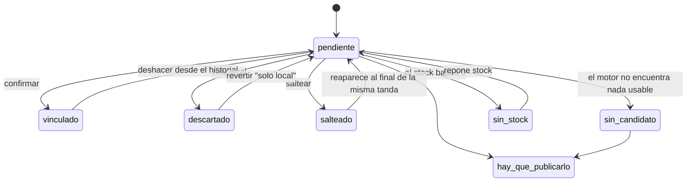

# Cobertura de Catálogo — especificación de flujo (UX)

Fecha: 2026-08-10 · Complementa `2026-08-10-cobertura-accionable.md` (decisiones del usuario)

## 0. Qué reemplaza a qué

`public/cobertura/index.html` se da de baja entera: cinco pestañas, informe de 693 renglones,
1 MB de payload, cero acciones. La reemplaza una herramienta de una tarea a la vez, con cola
priorizada y confirmación humana obligatoria. No se toca `public/vinculos/` (es el Matcher
ML→WC).

## 1. Pantalla de entrada (los primeros 3 segundos)

El trabajo real de esta pantalla es decidir *"¿le dedico los próximos 10 minutos, y por dónde
empiezo?"* — no vincular el primer producto.

```
Cobertura de catálogo
693 faltantes · $746 M sin publicar

▸ Seguir donde quedé: Metha (34 de 99)        ← solo si hay sesión abierta

Elegí una marca para trabajar:
[ Metha 99 · $XXM ] [ Venzo 41 · $XXM ] [ Vairo 28 · $XXM ] …

Otras secciones:
· Hay que publicarlo (52)   · Multi-publicación (18)
· Solo ML — sin SKU (3.6k)  · Sin stock (120)   · Problemas
```

- La decisión es **una sola** (qué marca), no 693 opciones sueltas. Top 8-10 marcas por conteo, el
  resto tras "ver todas".
- "Seguir donde quedé" es el elemento más grande y más arriba: es la acción más probable en una
  sesión repetida, y resuelve el requisito no negociable de retomar sin perder el hilo.
- Cada tarjeta de marca muestra **conteo y valor inmovilizado juntos**: eso ya cubre dos de las
  señales de priorización sin un ranking aparte. Dentro de la tanda, el orden interno usa stock
  alto primero.
- **Vacío real:** "No hay faltantes pendientes. Cobertura al día", con acceso a Multi-publicación
  y Solo ML, que pueden tener trabajo igual. Nunca una pantalla en blanco sin salida.

## 2. La cola: de a una, pantalla completa

Sin lista de fondo visible — a propósito: la pared de 693 renglones es lo que se está matando.

### Las cuatro señales de progreso, sin convertirse en tablero

```
Metha: ●●●●●●○○○○  34/99                    [ver todo]
Hoy resolviste 12 · desinmovilizaste $2.1M
```

- **Primaria:** avance de la marca actual. Es la única señal que responde "cuánto me falta para
  terminar lo que empecé", que es lo que decide si sigue o corta.
- **Secundaria, una línea chica, sin gráfico:** resueltos en la sesión + valor desinmovilizado.
  Refuerzo, no protagonista.
- **Faltantes totales NO viven acá:** ya se vieron en la entrada, y mientras resolvés Metha el
  total global no cambia tu próxima decisión. Queda en el link "ver todo".

Confirmar/descartar/saltear avanza solo, sin pantalla intermedia. Toast no bloqueante con
"Deshacer" inmediato. **Fin de tanda:** pantalla corta de cierre con "Elegir otra marca" y
"Volver". Nunca un callejón sin salida.

## 3. La tarjeta de confirmación

**Nivel 1 — sin scroll, ni en celular:**
1. Las **dos fotos** grandes, lado a lado. Una llanta azul contra una negra se ve en 0,3 s; un
   título hay que leerlo.
2. Los **dos títulos con las palabras que DIFIEREN resaltadas**, no las que coinciden. Esta es la
   inversión clave: el score alto engaña porque destaca lo compartido. Los tokens discriminantes
   (modelo, medida, marca) van con peso visual propio, coincidan o no.
3. **Confianza en palabras, no en porcentaje** ("Coincidencia alta / Revisar bien / Poco
   parecido"). Un "78%" no comunica "casi seguro mal", y los datos dicen que a menudo lo está.

**Nivel 2:** los dos precios; stock y categoría de cada lado, tipografía menor.
**A pedido:** atributos/variación completos, tras un toggle.

**Acciones:** `[ Confirmar vínculo ]` grande y al alcance del pulgar; debajo, en una fila de
igual peso entre sí: `Abrir en ML · Solo local · Hay que publicarlo · Saltear`. Ninguna es "más
correcta" que otra: son cuatro salidas del mismo caso. **Abrir en ML no consume la tarjeta.**

**Fricción proporcional al riesgo:** con "Poco parecido", Confirmar pide un toque extra
("¿Seguro? El sistema encontró poca coincidencia"). No se deshabilita —el usuario puede tener
certeza que el algoritmo no tiene— pero no es gratis. Con "Coincidencia alta" no hay fricción.

### Tensión declarada

Que el caso dudoso sea de dos segundos es exactamente el escenario que el hallazgo M520/M540
advierte evitar. El diseño hace que **el caso fácil sea instantáneo y el dudoso sea
deliberadamente más lento**, no que los dos sean igual de rápidos.

## 4. Varios candidatos y búsqueda manual

Máximo **3 candidatos** visibles, como tarjetas compactas con la misma estructura de nivel 1. Si
el motor devuelve más, el resto se alcanza por búsqueda manual — no se arma una segunda pared.

**Buscar manualmente** no es de segunda clase: es texto libre sobre las 3638 publicaciones sin
SKU, y el resultado elegido se muestra con **la misma tarjeta de comparación**, con las mismas
diferencias resaltadas. Está disponible **siempre**, incluso con candidato único, por si el
usuario no confía en ninguno de los propuestos.

## 5. Estados y transiciones



- **`salteado` no es terminal:** vuelve al final de la misma tanda. Si desapareciera, "verlo
  después" sería mentira.
- **`descartado` ("solo local")** mapea 1:1 con el `excluidos` que ya usa `lib/cobertura.js`. No
  hace falta campo nuevo: falta exponer la reversión, que hoy no existe en ningún lado.

## 6. Historial y deshacer

Sección propia, con buscador por producto o SKU:

```
Hoy, 14:32  Pedales Shimano M520 → MLA123   [Deshacer]
Ayer        Cubierta Maxxis → MLA789        [Deshacer]
```

Deshacer devuelve el producto a `pendiente` y, si el push a ML ya se efectivizó, dispara la
desvinculación. **Revertir un error no puede ser más difícil que cometerlo**: dado que un vínculo
equivocado es peor que ninguno, el deshacer tiene que ser al menos tan accesible como confirmar.

## 7. Multi-publicación y Solo ML

Secciones propias, **formato lista con acciones inline**, no tarjeta de a una: acá el trabajo no
es "¿es el mismo producto?" sino gestionar un conjunto ya vinculado.

**Multi-publicación** (>2 publicaciones por SKU):
```
SKU MET-0231 — Bicicleta Metha R29        [3 publicaciones]
 ✓ MLA111  Stock 4   [Marcar correcta] [Pausar] [Desvincular]
 ⚠ MLA333  Stock 0 — posible sobreventa   [Pausar] [Desvincular]
```
El encabezado dice explícitamente que **es intencional** (condiciones de venta distintas), para
que nadie —ni un empleado futuro— intente "arreglarlo" desvinculando todo. Solo pausar, nunca
cerrar. Pausar no pide confirmación extra: se deshace con un clic.

**Solo ML:** la contracara, tarjeta invertida (publicación a la izquierda, buscador de productos
web a la derecha). Con 3638, **no se recorre de a una**: se accede filtrando y buscando. Es zona
de consulta y limpieza puntual, no de tanda diaria.

## 8. "Hay que publicarlo"

Ordenada por valor, con las tres cosas pedidas: **tachar** (check manual, sin acción de sistema),
**exportar a Excel**, y **preparar datos para copiar y pegar** (título/SKU/precio/stock/categoría
en un bloque, con confirmación de "copiado"). No publica nada. Queda explícitamente marcada como
la base para automatizar la publicación en el futuro.

## 9. Vacíos, carga y errores

- **Carga inicial:** skeleton de las tarjetas de marca, no un spinner ciego.
- **Refresco:** botón "Actualizar desde ML" con "última actualización: hace X" **siempre
  visible**, para no tener que adivinar si los datos son frescos.
- **ML no responde al confirmar** — el punto donde se gana o se pierde la confianza: la decisión
  se guarda y se avanza igual, pero el mensaje **dice otra cosa** ("Guardado · se sincroniza con
  ML apenas se pueda", no "Vinculado a MLA123") y la fila queda marcada como pendiente de
  sincronizar en el historial. Si el mensaje fuera idéntico al del éxito, el día que el push
  falle en banda la persona descubriría semanas después que "vinculó" cosas que ML nunca recibió.
- **Falla la escritura local:** esto sí frena, con reintento. Es la única categoría que amerita
  bloquear, porque no hay nada que empujar después.

## Requisitos técnicos que este flujo impone

1. **El backend debe entregar por marca/tanda, no el universo entero.** Si el payload sigue
   siendo monolítico (1 MB), la pantalla de entrada tarda lo mismo que el informe viejo y la
   ganancia de velocidad se pierde antes de la primera tarjeta.
2. **El motor debe devolver, por candidato, cuáles tokens coinciden y cuáles difieren de forma
   estructurada** — no solo un score. Si solo devuelve un número, la tarjeta no puede resaltar
   diferencias y se cae la defensa central contra el error M520/M540.
3. El matcher inverso (WC→ML) no existe en `lib/matcherEngine.js`: hay que construirlo, con peso
   fuerte en tokens discriminantes.
