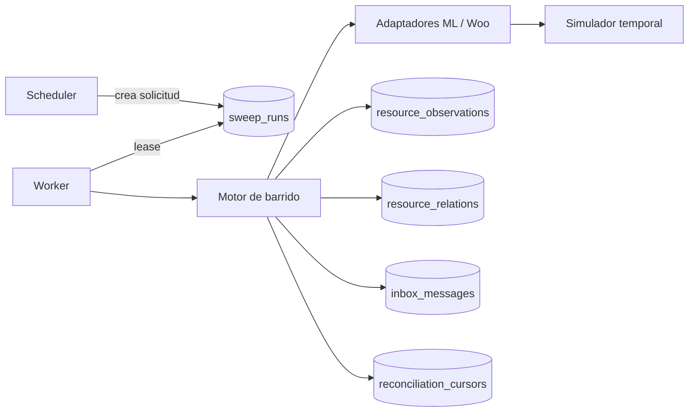
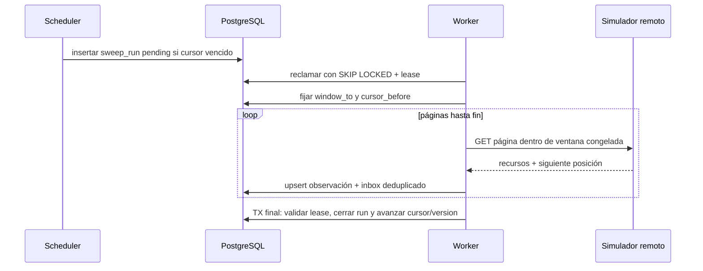

# E1 · Tramo 2 — Barridos y convergencia contra simulador

**Estado:** especificación aprobada por José el 2026-09-15; plan de implementación listo.  
**Entrega:** [E1 — Fundación PostgreSQL en sombra](../deliveries/E1-fundacion-sombra.md).  
**Depende de:** E0 aceptada y E1 tramo 1 verificado en entorno aislado.  
**Pruebas contractuales:** E1-SWP-01..09, E1-CONV-01 y E1-DEL-01 de [test-e1.md](e1/test-e1.md).  
**Matriz por tópico:** [matriz-barridos.md](e1/matriz-barridos.md).

## 1. Resultado y límites

El tramo entrega un motor de reconciliación exclusivamente de lectura, ejecutado por el worker y
programado por el scheduler, que recorre los ocho tópicos de la matriz contra un simulador temporal.
Demuestra que una señal ausente se reconstituye, que una corrida incompleta no adelanta el cursor y
que recursos sin historial enumerable convergen al estado remoto actual.

No usa credenciales, no consulta ML/Woo reales, no conecta con PostgreSQL de E0, no modifica el
legado, no proyecta catálogo/pedidos/stock y no incorpora `missed_feeds`. Esta última fuente pertenece
al tramo 3: será suplementaria y tendrá cursor separado; nunca sustituirá la relectura del recurso.

## 2. Decisiones técnicas cerradas

| Tema | Decisión | Fundamento verificable |
|---|---|---|
| Unidad de programación | una corriente por cuenta+tópico+`state_sweep` | deja lugar a `missed_feed` en T3 sin mezclar posiciones |
| Ejecución | scheduler crea solicitudes; worker las reclama con lease | scheduler no llama canales y varias réplicas no duplican corridas |
| Ventanas | `[window_from, window_to]` congelada al iniciar | una colección que cambia durante el paginado no puede mover el límite superior |
| Cursor | avanza sólo en la misma transacción que cierra una corrida exitosa | una página fallida repite toda la ventana con solape y deduplicación |
| Solape temporal | 600 s donde exista fecha remota | tolera orden imperfecto y reloj remoto sin producir duplicados |
| Datos remotos | AES-256-GCM con sobre versionado en inbox; observaciones sólo guardan versión, hashes y ciclo de vida | permite auditoría/convergencia sin persistir PII en claro |
| Bajas por conjunto | marca `last_seen_run_id`; sólo una vuelta completa exitosa puede declarar ausente | una corrida parcial nunca fabrica borrados |
| Orden y duplicados | unicidad existente cuenta+tópico+recurso+versión; una versión menor no reemplaza la observación actual | impide regresión por señales fuera de orden |
| Fallos | 408/429/5xx retryable; `Retry-After` acotado; 401/403 terminal; timeout 5 s por llamada | clasificación común de E1, sin reintentos infinitos |
| Seguridad del cliente | T2 sólo acepta URL loopback o nombre del servicio Docker `simulator`; métodos distintos de GET fallan antes de red | imposibilita un efecto remoto accidental desde el ensayo |
| Retención | observaciones y relaciones técnicas: 400 días tras el último avistamiento; payload cifrado: 90 días | PM-178; cubre comparación interanual sin conservar PII indefinidamente |

## 3. Componentes y archivos

| Estado | Ruta | Responsabilidad |
|---|---|---|
| existente | `plataforma/src/colas/colas.ts` | inbox durable y deduplicación final |
| modificar | `plataforma/src/scheduler/scheduler.ts` | materializar corridas vencidas, sin llamar canales |
| modificar | `plataforma/src/worker/main.ts` | registrar procesador de corridas |
| nuevo | `plataforma/src/reconciliacion/tipos.ts` | contratos de adaptadores, páginas y observaciones |
| nuevo | `plataforma/src/reconciliacion/cliente-http.ts` | GET, timeout, límites, `Retry-After`, allowlist de destino |
| nuevo | `plataforma/src/reconciliacion/motor.ts` | ventana, paginado, hashes, promoción y cursor atómicos |
| nuevo | `plataforma/src/seguridad/sobre.ts` | AES-256-GCM, AAD, versión de sobre y key id |
| nuevo | `plataforma/src/reconciliacion/adaptadores/*.ts` | estrategia exacta por tópico |
| modificar | `scripts/qa/simulador-canales.mjs` | fixtures temporales, paginado y fallos deterministas |
| nuevo | `plataforma/migrations/0003_reconciliacion.sql` | corrientes, leases y observaciones |
| modificar | `docs/superpowers/specs/e1/schema.sql` | referencia canónica posterior a 0003 |
| nuevo | `plataforma/test/reconciliacion/*.test.ts` | SWP-01..09, CONV-01 y DEL-01 |

## 4. Modelo relacional expand-only

### `integrations.reconciliation_cursors`

- Agrega `cursor_kind text NOT NULL DEFAULT 'state_sweep'` con formato
  `^[a-z][a-z0-9_]{1,31}$`.
- Agrega `enabled boolean NOT NULL DEFAULT true`; una corriente deshabilitada conserva posición y
  no puede generar nuevas corridas.
- La PK pasa a `(channel_account_id, topic, cursor_kind)`.
- Conserva `strategy`, `cursor_value`, solape, intervalo, `next_run_at`, `last_success_at` y
  `version`. T3 podrá agregar `cursor_kind='missed_feed'` sin reinterpretar el cursor actual.
- `cursor_value` cambia de `text` a `jsonb`, nullable antes de la primera corrida, con CHECK de
  objeto, `v=1` y forma admitida. Es JSON canónico versionado:
  `{"v":1,"updated_at":"…","tie_breaker":"…"}` o
  `{"v":1,"generation":"…"}` para recorridos completos.
- La migración conserva cualquier cursor textual preexistente como
  `{"v":1,"legacy":"<valor>"}` y deja esa corriente deshabilitada hasta que su adaptador la convierta
  mediante una corrida explícita; el DDL no interpreta texto histórico.

### `integrations.sweep_runs`

- `status`: `pending`, `claimed`, `succeeded`, `retryable`, `failed` o `partial`.
- Agrega `cursor_kind`, `scheduled_for`, `available_at`, `attempts`, `max_attempts`,
  `lease_token`, `lease_until`, `worker_id`, `cursor_before`, `cursor_after` y
  `correlation_id`.
- Restricción equivalente a las colas: `claimed` si y sólo si existen token, vencimiento y worker.
- Índice parcial único: como máximo una corrida `pending|claimed|retryable` por
  cuenta+tópico+cursor_kind.
- `partial` y `failed` conservan evidencia, pero nunca modifican el cursor.
- Una fila histórica `running` se transforma en `partial` antes de reemplazar el CHECK; no puede
  existir una ejecución real de T2 porque el tramo aún no fue desplegado.
- FKs a cuenta+tópico+cursor_kind; `ON DELETE RESTRICT`. Índices por
  `(status,available_at,id)`, lease vencido y cuenta+tópico+inicio descendente.

### `integrations.resource_observations`

| Columna | Regla |
|---|---|
| cuenta+tópico+`resource_id` | PK lógica |
| `remote_version` | versión/fecha/hash remoto que ganó según el comparador del adaptador |
| `remote_updated_at` | nullable cuando el remoto no ofrece fecha |
| `remote_hash` | SHA-256 del recurso canónico completo antes de cifrar |
| `projection_hash` | SHA-256 del subconjunto de estado usado para convergencia |
| `lifecycle` | `open`, `closed`, `deleted` o `unknown` |
| `last_seen_run_id` | FK a la última vuelta completa que lo observó |
| `first_seen_at`, `last_seen_at` | reloj PostgreSQL |
| `last_enqueued_version` | permite demostrar si la observación ya produjo inbox |

No guarda nombres, direcciones, mensajes, emails ni payload JSON. El payload que necesite el
procesador permanece cifrado en `inbox_messages.payload_ciphertext` y se elimina según la retención
de E1. `resource_observations` tiene PK `(channel_account_id,topic,resource_id)`, FK de cuenta y
`last_seen_run_id ON DELETE SET NULL`; índices parciales por lifecycle y avistamiento. Un trabajo
diario elimina observaciones cerradas/borradas cuyo `last_seen_at < now()-400 days`; nunca elimina
abiertas. José fijó esta retención en PM-178 el 2026-09-15.

### `integrations.resource_relations`

Conserva los identificadores necesarios para que cada barrido siga siendo independiente sin guardar
payload: PK `(channel_account_id,relation_type,source_topic,source_id,target_topic,target_id)`, tipos
permitidos `order_shipment`, `order_pack` y `product_variation`; `first_seen_at`, `last_seen_at`,
`last_seen_run_id` y `lifecycle`. Una orden produce relaciones a envío y pack en la misma transacción
de página; un producto padre produce relaciones a variaciones. Las relaciones cerradas se retienen
400 días; las activas no expiran. No hay FK entre IDs remotos porque pueden descubrirse antes de que
exista su observación.

### Sobre cifrado de inbox

`inbox_messages` agrega `payload_key_id text`, `payload_nonce bytea` (12 bytes) y
`payload_tag bytea` (16 bytes), todos presentes o todos nulos junto con `payload_ciphertext`.
`plataforma/src/seguridad/sobre.ts` usa AES-256-GCM de `node:crypto`; AAD canónico:
`v1\0<account>\0<topic>\0<resource>\0<remote_version>`. El keyring JSON contiene una clave activa
y claves anteriores por id; archivo 0400/0600 fuera del repo. T2 genera un keyring efímero de 32
bytes dentro de su directorio temporal. No existe fallback, clave en variable ni criptografía propia.
La rotación real y custodia pertenecen al tramo 3; T2 prueba cifrar, descifrar, AAD alterado y key id
desconocido.

## 5. Protocolo de una corrida

1. El scheduler bloquea la corriente habilitada, comprueba `next_run_at <= now()`, inserta una corrida
   si no hay otra activa y mueve `next_run_at` al primer instante programado posterior a `now()`; no
   deriva el calendario desde la hora de término.
2. El worker reclama con `FOR UPDATE SKIP LOCKED`. Lease inicial: 60 s; renueva antes de 30 s.
3. Congela `window_to=now()` y calcula `window_from=cursor.updated_at−overlap`.
4. Cada página se valida antes de persistir. La transacción de página inserta observación e inbox;
   repetirla es inocuo por las restricciones únicas.
5. Una corrida completa cierra y avanza el cursor mediante `WHERE version=expected_version`. Un
   conflicto deja la corrida `partial`; nunca pisa un cursor más nuevo.
6. Ante fallo, guarda código seguro sin cuerpo remoto ni secretos. El cursor queda intacto.
7. Para recorridos de conjunto completo, las bajas se calculan sólo después de la última página y
   dentro del cierre exitoso. Cada ausencia genera una nueva versión `deleted:<run-id>` exactamente
   una vez.
8. `retryable` conserva la misma corrida y lease vacío. `available_at` usa
   `min(900 s,30 s×2^(attempt-1))` con jitter inyectable ±20 %; `Retry-After` válido prevalece hasta
   300 s. Tras 8 reclamos pasa a `failed`. La siguiente corrida normal podrá crearse en su calendario;
   el cursor seguirá en el último éxito.

### Bootstrap por tópico

| Tópico | Primera posición |
|---|---|
| órdenes ML/Woo | `window_to−30 días`, en ventanas consecutivas de hasta 6 h |
| envíos ML | relaciones `order_shipment` producidas por órdenes; ninguno se inventa si aún no existen |
| mensajes ML | unread completo y relaciones `order_pack` de órdenes de 30 días |
| preguntas ML | conjunto UNANSWERED completo; luego conocidas individuales |
| reclamos ML | conjunto abierto completo; luego conocidos individuales |
| items ML | scan completo desde inicio |
| productos Woo | conjunto completo padres+variaciones desde página 1 |

El bootstrap termina sólo cuando completa todo su universo. Hasta entonces informa cobertura parcial,
no declara bajas y no promete convergencia de dependientes. En pruebas, scheduler materializa primero
órdenes y productos; envíos/mensajes quedan elegibles después de confirmar sus relaciones.

## 6. Contrato de adaptadores

Cada adaptador implementa `listar(contexto, posicion)` y devuelve recursos normalizados, relaciones y
una posición opaca. También define `versionDe`, `compararVersion`, `estadoDe` y `proyeccionDe`. El
motor no conoce formas ML/Woo. Las versiones temporales se comparan como instantes UTC y desempatan
por id. Una versión hash sólo distingue igualdad: una relectura GET de la corrida más nueva es
autoridad y reemplaza la observación; un webhook futuro nunca aplicará un hash sin releer primero.

| Tópico | Ventana/paginación | Identidad y versión | Criterio |
|---|---|---|---|
| `ml.orders` | fecha última modificación, ventanas máximas 6 h, `window_to` fijo, limit 50/offset | order id + `date_last_updated` | enumerable |
| `ml.shipments` | IDs conocidos abiertos o cerrados ≤30 días; GET individual con `x-format-new:true` | shipment id + `last_updated` | convergencia |
| `ml.questions` | conjunto UNANSWERED; conocidas por GET individual | question id + fecha/hash | enumerable de abiertas + convergencia conocidas |
| `ml.messages` | unread y packs de órdenes ≤30 días, siempre `mark_as_read=false` | message id + fecha/hash | enumerable limitada + convergencia por pack |
| `ml.claims` | abiertas enumerables; conocidas cerradas por GET | claim id + última actualización/hash | enumerable + convergencia |
| `ml.items` | `search_type=scan`, multiget de 20, vuelta completa | item/variation id + `last_updated` o hash | conjunto completo diario |
| `woo.orders` | `modified_after/before`, GMT, 100 por página ascendente | order id + `date_modified_gmt` | enumerable; IDs completos semanal |
| `woo.products` | modificados + variaciones; IDs completos diario | product/variation id + `date_modified_gmt` | enumerable + bajas por conjunto |

Una página se rechaza completa si falta identidad o versión. El rechazo incrementa `failed`, deja
detalle sanitizado y conserva el cursor. No se inventa una fecha con el reloj local; cuando el remoto
no ofrece versión se usa SHA-256 canónico y el adaptador declara esa limitación.

La proyección técnica no es una tabla de dominio. Es JSON canónico usado sólo para hash:

| Tópico | Campos exactos de proyección |
|---|---|
| órdenes | `id,status,date_last_updated|date_modified_gmt,shipping.id,pack_id` |
| envíos | `id,status,substatus,last_updated` |
| preguntas | `id,status,date_created,answer.status` |
| mensajes | `id,pack_id,status,date_created,date_available` presentes |
| reclamos | `id,status,last_updated,stage` presentes |
| items | `id,status,sub_status,last_updated,variations[].{id,available_quantity}` |
| pedidos Woo | `id,status,date_modified_gmt` |
| productos Woo | `id,parent_id,status,date_modified_gmt` |

Campos ausentes se representan como `null`; arrays se ordenan por id; objetos ordenan claves UTF-8.
Ningún nombre, texto de mensaje, domicilio, email o importe entra en esta proyección.

## 7. Simulador y fixtures

El snapshot anonimizado actual sólo sirve como semilla. T2 agrega fixtures en memoria pasados a
`crearSimulador({fixture,reloj})`; no escribe el SQLite ni configura escenarios por HTTP:

- Reloj inyectable, páginas deterministas y mutaciones entre páginas controladas por fixture.
- Registro de headers y consultas para comprobar `mark_as_read=false`, `x-format-new`, ventanas y GMT.
- Fallos antes de respuesta, después de respuesta, 401/403/408/429/5xx y `Retry-After`.
- Recursos que desaparecen del conjunto completo sin webhook de borrado.

El registro `/__qa/llamadas` y la inyección de fallos ya existentes pueden consultarse/controlarse
desde el arnés, pero el gate de sólo GET se aplica al `TransporteCanal` del motor, no al plano de
control del simulador. Los fixtures no contienen datos reales ni secretos.

## 8. Casos de uso y fallos

| Caso | Flujo esperado | Evidencia |
|---|---|---|
| señal perdida | barrido enumera versión ausente y crea un inbox `source=sweep` | SWP-01..08 |
| página 3 falla | run retryable/failed, cursor idéntico; próxima corrida repite sin duplicar | SWP-09 |
| versión vieja llega tarde | se conserva observación nueva; inbox histórico no cambia proyección | DUP-01 ampliado |
| 5 de 20 envíos cambian | 20 cubiertos, sólo 5 encolados, convergencia 100 % | CONV-01 |
| producto Woo desaparece | vuelta completa exitosa genera baja; corrida parcial no | DEL-01 |
| dos workers | uno reclama la corrida; el otro toma otra o espera | prueba de lease |
| worker muere | lease vence, reintento repite páginas y termina una sola corrida lógica | prueba de recuperación |
| 429 | respeta `Retry-After` hasta 300 s y aplica jitter; cursor inmóvil | prueba HTTP |
| 401/403 | corrida failed e incidente visible; no reintento automático | prueba HTTP/API |

## 9. Observabilidad y operación

- Métricas por cuenta+tópico: corridas, duración, páginas, llamadas, enumerados, faltantes
  encolados, duplicados, cobertura, convergencia, divergencias, bajas y edad del último éxito.
- Alertas: último éxito >2× intervalo; corrida activa con lease vencido; tres fallos consecutivos;
  cobertura <100 %; convergencia <100 % al cierre; 401/403 inmediato.
- El responsable técnico atiende fallos del motor; José sólo interviene ante credenciales/cuenta o
  una discrepancia de producto. T2 no envía emails ni genera el reporte firmado de T4.
- SOP: pausar la corriente con `next_run_at=NULL` no está permitido. Se usa el campo
  `enabled`; al reactivarla conserva cursor y ejecuta una ventana con solape.

## 10. Rollout y rollback

T2 sólo corre dentro de `npm run test:e1`. No existe canario ni corte productivo. La migración 0003
se prueba desde cero y sobre 0001+0002. Rollback del ensayo: destruir el proyecto Docker temporal.
El rollback de código es revertir el commit antes de cualquier futuro despliegue; no hay efectos
remotos que compensar. Las migraciones siguen siendo forward-only.

## 11. Gate de aceptación del tramo

- Los once escenarios T2 pasan con payloads no vacíos y fallan si se retira la condición probada.
- Dos ejecuciones consecutivas producen el mismo estado, salvo timestamps controlados.
- Ningún método distinto de GET aparece atribuido al `TransporteCanal`; llamadas `__qa` se etiquetan
  como plano de control y no cuentan como canal.
- Una corrida fallida no cambia cursor ni declara bajas.
- Todos los payloads persistidos están cifrados; observaciones no contienen PII.
- `npm --prefix plataforma run typecheck`, suite de plataforma, `npm run test:e1`, validador
  documental y `git diff --check` pasan.
- Cero credenciales reales, conexiones a E0 o procesos de prueba restantes.

## 12. Fuentes y hallazgo fechado

- [Mercado Libre — Notificaciones](https://developers.mercadolibre.com.ar/es_ar/productos-recibe-notificaciones),
  consultada 2026-09-15: `missed_feeds` conserva hasta dos días y exige `site_id` para `items`. Se
  difiere a T3 como suplemento con cursor propio.
- [Mercado Libre — Gestiona ventas](https://developers.mercadolibre.com.ar/es_ar/publica-productos/gestiona-ventas),
  consultada 2026-09-15: `/orders/search` permite filtrar por `order.date_last_updated`; T2 congela
  el límite superior y acota ventanas para evitar deriva.
- [WooCommerce REST API v3](https://woocommerce.github.io/woocommerce-rest-api-docs/), consultada
  2026-09-15: `modified_after`, `modified_before`, `dates_are_gmt`, paginación y
  `date_modified_gmt` sostienen los adaptadores Woo.

No quedan decisiones de producto abiertas dentro del tramo 2. PM-178 registra la retención de 400
días aprobada por José el 2026-09-15. Esta aprobación autoriza implementar sólo contra infraestructura efímera; no autoriza
el tramo 3 ni producción.
