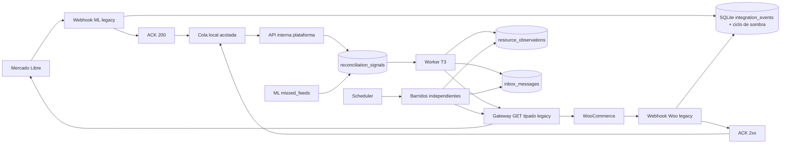

# E1 tramo 3 — sombra conectada a producción

- **Estado:** diseño revisado el 2026-09-16, con las correcciones de esa revisión aplicadas; implementación no iniciada.
- **Fecha:** 2026-09-16.
- **Decisiones:** PM-174, PM-179, PM-180, PM-181, PM-182 y PM-183.
- **Dependencias:** E0 aceptada; E1 T1 y T2 implementados y verificados en infraestructura efímera.
- **Autorización:** este documento especifica T3, pero no autoriza despliegue, credenciales ni tráfico real.

## 1. Resultado y límite del tramo

T3 conecta la fundación y los barridos de T1–T2 con señales reales de Mercado Libre y WooCommerce
sin dar autoridad de negocio a PostgreSQL y sin permitir escrituras remotas. Termina con un soak de
24 horas. La campaña contractual de siete días, la firma, el email, Object Lock y passkeys pertenecen
a T4.

T3 entrega:

- cuentas ML y Woo separadas y corrientes compatibles con el canal;
- recibos mínimos y auditables en SQLite;
- copia posterior al ACK mediante una cola local acotada;
- señales separadas de observaciones autoritativas;
- relecturas GET tipadas a través del legado, dueño exclusivo de credenciales;
- barridos independientes como mecanismo de reparación;
- `missed_feeds` como suplemento, no como garantía de reparación;
- prueba contractual de latencia y caída de PostgreSQL;
- 24 horas en vivo estables antes de habilitar T4.

No entrega proyecciones de catálogo, pedidos o stock, comandos remotos, UI, passkeys reales ni
reportes firmados.

## 2. Hallazgos que corrige

1. El worker T2 sólo admite una cuenta y registra adaptadores ML y Woo juntos.
2. `integrations.sembrar_corrientes(cuenta)` crea diez corrientes sin comprobar el canal.
3. El motor sólo procesa barridos; no existe una relectura puntual disparada por señal.
4. Un webhook no es verdad remota y no debe entrar directamente en `inbox_messages`.
5. Woo orders responde antes de persistir; T3 exige un recibo SQLite mínimo antes del ACK.
6. La plataforma no puede refrescar el token ML: el refresh token es de un solo uso y el lock actual
   vive dentro del proceso legacy.
7. Nginx tiene dos caminos al mismo Express (`location /` y `location /herramientas/`, este último con
   barra final, que quita el prefijo): un endpoint `/internal/` sería público por ambas vías si no se
   niegan las dos.
8. `missed_feeds` sólo conserva dos días y sólo contiene avisos que nunca recibieron HTTP 200.
9. El multiget ML de T2 lee `code` por elemento; `/items/bulk?ids=` informa `status_code` y mejora el
   diagnóstico. Verificado por sonda el 2026-09-16: los dos endpoints responden, así que la migración
   conviene pero no bloquea el tráfico real (§10).
10. Los siete días y el reporte firmado se habían atribuido erróneamente a T3; pertenecen a T4.

## 3. Arquitectura

### Invariantes

- El ACK nunca espera PostgreSQL, plataforma ni una API remota.
- Woo orders sí espera exclusivamente el recibo SQLite mínimo decidido por José.
- PostgreSQL caído sólo descarta y cuenta la copia de sombra; no cambia el ACK.
- El handler realiza un único intento posterior al ACK; no reintenta ni retiene payloads.
- La relectura remota o el barrido son las únicas fuentes de observaciones autoritativas.
- T3 sólo permite GET remoto y no proyecta datos de negocio.
- ML y Woo usan `channel_account_id` distintos.
- La plataforma no recibe tokens ML ni consumer keys Woo.

## 4. Recibo mínimo: ciclo de vida sobre `integration_events`

**Decisión de José del 2026-09-16, tomada en la revisión de este diseño: no hay tabla nueva.** El
recibo que T3 necesitaba ya existe: `lib/workerIntegrationJobs.js:94` (ML) y `:137` (Woo products)
persisten **antes del ACK**, dentro de una transacción, en `integration_events` con canal, tópico,
recurso normalizado, fingerprint (`external_event_id`), notification/delivery id, `occurred_at`,
`received_at`, correlación, `dedupe_key` y estado, más su traza en `integration_event_history`. Crear
una tabla paralela habría duplicado esa identidad y duplicado las escrituras por aviso —hoy ~1.400 por
día— en la misma base que atiende producción.

Lo que T3 agrega es el **ciclo de vida de la copia**, como columnas del evento existente:
`shadow_status`, `shadow_reason`, `ack_at`, `enqueue_at`, `completed_at`, `boot_id`, `attempt_id` y
`shadow_imported_at`.

Estados de sombra: `pending`, `queued`, `attempting`, `copied`, `discarded`, `excluded` y `abandoned`.
Razones: `unsupported_topic`, `foreign_account`, `queue_full`, `platform_timeout`,
`platform_unavailable`, `invalid_resource`, `process_stopped` y `response_not_finished`.

- El ciclo de sombra nunca agrega body, firma, token, nombre, dirección, email ni teléfono. El
  `metadata_json` que el legado ya guarda para ML incluye `text` y `title` del aviso: T3 no los usa ni
  los amplía, y revisarlos es una decisión separada de este tramo.
- La identidad y la deduplicación siguen siendo las del evento: no se inventa una unicidad nueva.
- **Woo orders es el único canal sin recibo:** hoy responde antes de persistir (`server.js:130`). C2 le
  agrega su propio evento con la misma forma, escrito antes del ACK, y un fallo de SQLite responde 503
  (PM-180). Es el único cambio de código de respuesta que T3 introduce en el legado.
- **Cuenta ajena:** hoy el legado responde 200 sin persistir, a propósito, porque un tercero podría
  saturar SQLite con `user_id` al azar (`server.js:342`). Por decisión del 2026-09-16 sí se persiste
  como `excluded/foreign_account`, pero con defensa explícita: límite por IP y ventana de tiempo, y
  purga agresiva y separada de esas filas. Sin esa defensa implementada y probada, el corte C2 no pasa.
- **Retención: 400 días en la misma base**, con purga diaria por lotes pequeños. Esto fija por primera
  vez una retención sobre `integration_events`, que hoy crece sin límite. La purga sólo alcanza filas
  cuyo ciclo de sombra es terminal **y** cuyo trabajo legacy está cerrado, para no truncar el historial
  de un evento todavía en curso; cambiar la retención del historial legacy más allá de eso es una
  decisión propia y no la toma este tramo.
- Al iniciar, las filas activas de otro `boot_id` pasan a `abandoned/process_stopped`.
- Un watchdog abandona intentos vencidos del proceso actual.

Los listeners `finish` y `close` se registran antes de responder. Sólo `finish` habilita la copia;
`close` sin `finish` produce `abandoned/response_not_finished`.

## 5. Cola posterior al ACK

- Capacidad 256, concurrencia 2 y un único intento.
- Timeout total de 250 ms por llamada local.
- Sólo transporta cuenta lógica, tópico, recurso, delivery id/fingerprint y timestamps.
- Cola llena produce `discarded/queue_full` de forma síncrona y auditable.
- Timeout o plataforma caída producen descarte; nunca una promesa suelta ni memoria ilimitada.
- El flag de copia nace apagado.

## 6. Señales PostgreSQL

`integrations.reconciliation_signals` es distinta de `inbox_messages`. Guarda cuenta, tópico,
recurso, notification id/fingerprint, fuente (`webhook_copy` o `ml_missed_feed`), estado, lease,
intentos, error normalizado y tiempos.

Estados: `pending`, `claimed`, `succeeded`, `retryable`, `dead_lettered`, `excluded`.

- Unicidad por aviso.
- Una sola señal activa coalescida por cuenta+tópico+recurso.
- FK a `core.channel_accounts` y check cerrado a los ocho tópicos de E1.
- `inbox_messages` sólo recibe el payload obtenido mediante GET remoto y cifrado por el motor.
- Una señal nunca se presenta como observación ni se proyecta.

### Equivalencia de tópicos remotos

Los nombres que mandan los canales no son los ocho tópicos de E1, y de esta tabla depende qué queda
`excluded/unsupported_topic`:

| Aviso remoto | Tópico E1 |
|---|---|
| ML `orders`, `orders_v2` | `ml.orders` |
| ML `shipments` | `ml.shipments` |
| ML `questions` | `ml.questions` |
| ML `messages` | `ml.messages` |
| ML `claims`, `post_purchase` | `ml.claims` |
| ML `items` | `ml.items` |
| Woo `order.created`, `order.updated` | `woo.orders` |
| Woo `product.created`, `product.updated`, `product.deleted` | `woo.products` |

Cualquier otro aviso (`orders_feedback`, `invoices`, `payments`, `stock-location`, etc.) se cuenta y se
excluye; ampliar esta tabla amplía E1 y exige decisión propia.

### API interna de señales

`POST /internal/v1/reconciliation-signals`, máximo 16 KiB:

- HMAC con timestamp, nonce y dos claves simultáneas para rotación;
- ventana de cinco minutos y nonce único contra replay;
- la configuración resuelve la cuenta; el cliente no envía un UUID arbitrario;
- `202` aceptada/duplicada, `400` envelope inválido, `401` autenticación, `409` canal/tópico,
  `413` tamaño y `503` PostgreSQL caído;
- no se publica por Nginx y rechaza orígenes fuera de la red interna configurada.

Precisiones fijadas al implementar C3 (2026-09-16): un **nonce repetido responde `401`** —es un replay,
falla de autenticación— aunque la firma sea válida, y los nonces viven en PostgreSQL
(`integrations.signal_nonces`) para que un reinicio no reabra la ventana; un **aviso repetido con nonce
nuevo responde `202 duplicate`** sin segunda fila; un origen fuera de las redes internas también es
`401`; una cuenta configurada que no existe en la base es `409`. La firma v1 cubre timestamp, nonce,
método, path y el SHA-256 del cuerpo crudo, y el módulo `plataforma/src/seguridad/interna.ts` queda
para reutilizarlo en el gateway de C5.

## 7. Cuentas y corrientes

La configuración pasa de una cuenta T2 a un registro de cuentas. Cada entrada define UUID,
canal, identificador externo, URL del gateway y metadatos específicos sin credenciales remotas.

La siembra consulta `core.channel_accounts.channel`:

- ML: orders, shipments, questions, messages, claims e items;
- Woo: orders incremental/full y products incremental/full.

La migración es forward-only: crea faltantes, conserva historial, deshabilita incompatibles sólo si
no están activas y falla ante canal ambiguo. El worker reclama por cuenta+tópico+`cursor_kind` y
elige el adaptador del registro, nunca por variables globales de una única cuenta.

## 8. Gateway interno de sólo lectura

`POST /internal/v1/channel-read` acepta operaciones simbólicas con esquemas cerrados, nunca URL,
host, método ni query libres. Operaciones mínimas:

- ML: orden, envío, pregunta, reclamo, item bulk, no leídos, pack, búsquedas de los barridos y
  `missed_feeds`;
- Woo: orden, producto y listados necesarios por los barridos.

El gateway usa `mlFetch` y el cliente Woo existentes, centraliza OAuth, cooldown y cuota, ejecuta
sólo GET, limita tiempo/tamaño y sanea errores. Registra operación, cuenta, duración y resultado sin
PII. La plataforma accede por `host.docker.internal` con `host-gateway`.

**Exposición pública: hay dos caminos, no uno.** El sitio de Nginx tiene `location /` y también
`location /herramientas/`, y este último proxea con `proxy_pass http://127.0.0.1:3001/` —con barra
final—, así que **quita el prefijo**: una petición a `/herramientas/internal/v1/channel-read` llega a
Express como `/internal/v1/channel-read`. El deny debe cubrir las dos formas (`/internal/` y
`/herramientas/internal/`) y cualquier otra que, tras el reescribido, termine en la ruta interna; se
verifica desde Internet contra ambas URLs. HMAC y validación de origen son defensa adicional, no la
principal.

**Relación con el invariante de T2.** `plataforma/src/reconciliacion/cliente-http.ts` rechaza todo
método distinto de GET antes de tocar la red (`ErrorMetodoProhibido`) y su allowlist es
`127.0.0.1|localhost|[::1]|simulator`; el gate de T2 exige que ninguna llamada con método distinto de
GET se atribuya al transporte de canal. El `POST /internal/v1/channel-read` es **plano de control
local**, no una llamada de canal: viaja por un transporte propio, distinto del `TransporteCanal`, y no
lleva el rótulo `x-fusion-plano: canal`. El invariante de T2 sigue valiendo tal cual para lo remoto y
no se relaja ni se reescribe su prueba; el corte C5 sólo agrega `host.docker.internal` a la allowlist
de ese transporte local.

Precisiones fijadas al implementar C5 (2026-09-16):

- **Tres caminos públicos, no dos.** Además de `location /` y `location /herramientas/` del sitio
  `herramientas` (443), el sitio `fusionbikes` (80, `default_server`, por IP) proxea `/herramientas/`
  con barra final. Express enruta sin distinguir mayúsculas, así que el deny es una regex
  insensible a mayúsculas, `~* ^/(herramientas/+)?internal(/|$)`, en **los dos** sitios.
  Verificable con `scripts/qa/deny-interno.sh`.
- **El puerto 3001 del legado es alcanzable desde Internet sin pasar por Nginx** (escucha en `*`,
  sin firewall). Por eso el origen del gateway se valida contra la dirección del socket —nunca
  `X-Forwarded-For`— y sólo se admite la red de Docker; cerrar 3001 hacia afuera es una decisión
  operativa aparte, no de este corte.
- El HMAC del plano de control usa un keyring **propio** (`BARRIDOS_GATEWAY_KEYRING_FILE` en la
  plataforma, `GATEWAY_KEYRING_FILE` en el legado), separado de las claves de sobres.
- Los nonces del legado viven en SQLite (`internal_nonces`, migración 105).
- El registro de cuentas elige transporte (`gateway` por defecto, `directo` sólo para el simulador).
- El bucket `shadow` de ML (`GATEWAY_ML_SHADOW_RPM`) queda en **0**: el gateway responde 429
  sintético sin salir a red hasta que se mida y se fije el techo (C7).

### Presupuesto remoto

ML agrega clase `shadow`: consume global+lectura y un bucket propio que nunca toma capacidad
reservada al legado. El techo se determina después de medir siete días de llamadas; hasta entonces
queda en cero y bloquea el canario. Woo usa concurrencia 1 por cuenta y respeta `Retry-After`.

## 9. Procesamiento

Las señales se reclaman con lease y se coalescen.

- Orders, shipments, questions, claims, items, Woo orders y Woo products usan GET puntual.
- El resultado reutiliza validación, canonización, orden de versiones, observación e inbox de T2.
- Un 404 sólo declara baja cuando el contrato del recurso lo permite; de otro modo queda explicado
  y el barrido decide.
- Una versión vieja nunca reemplaza una nueva.
- Messages no usa el id del aviso: dispara el barrido de no leídos y packs con
  `mark_as_read=false`, coalescido por cuenta.
- Tópicos fuera de E1 quedan `excluded` sólo en SQLite con razón y conteo; no amplían E1.

Precisiones fijadas al implementar C6 (2026-09-16):

- `resource_id` de una señal es el **id remoto pelado** (`5000`, `MLA123`), no la ruta del aviso; un id
  fuera del formato del tópico deja la señal `excluded/invalid_resource` sin tocar la red.
- Baja por 404 en relectura sólo en `ml.questions` y `ml.claims` (igual que el barrido de conocidos).
  Órdenes, envíos, ítems y pedidos/productos Woo cierran la señal `succeeded` con
  `not_found:sin_baja`: las bajas las declaran sus vueltas completas.
- El inbox marca el origen `signal_reread` (migración 0007). Una relectura **nunca** toca
  `last_seen_run_id` (ni de observación ni de relación): ponerlo en NULL durante una vuelta completa
  haría que `declararBajas` tomara como ausente un recurso existente.
- El resultado se persiste en la misma transacción que cierra la señal y sólo con el lease vigente.
- El gateway suma `ml.order`, `woo.order` y `woo.product` (lecturas individuales).
- 429/5xx → `retryable` con `Retry-After` o backoff 10 s·2ⁿ⁻¹ (máx. 15 min); terminal o intentos
  agotados → `dead_lettered`.

## 10. `missed_feeds` y ML bulk

Cada 30 minutos se enumera desde offset cero el universo de hasta dos días. No se usa cursor para
omitir filas: se deduplica por notification id y se informa cobertura. Para items, `site_id` es
obligatorio. El resultado crea señales y nunca observaciones directas.

**Configuración, con los nombres que ya existen en producción.** El legado arma su config ML con
`ML_CLIENT_ID`, `ML_CLIENT_SECRET` y `ML_USER_ID` (`server.js:525`), y en Mercado Libre el *app id* es
ese mismo client id: T3 no introduce `ML_APP_ID`, reusa `ML_CLIENT_ID`. `ML_SITE_ID` sí es nueva —hoy no
está en el `.env`— y es obligatoria para `missed_feeds` de items: se agrega con el sitio de la cuenta y
se valida contra `ML_USER_ID` antes de habilitar el canario.

**Multiget de items, verificado por sonda autenticada de sólo lectura el 2026-09-16** (autorizada por
José; dos GET, sin rotar el token porque quedaban 253 minutos de vigencia):

| Endpoint | Estado | Forma por elemento |
|---|---|---|
| `GET /items?ids=` | 200 | `{code, body}` — el que usan hoy el legado y T2 |
| `GET /items/bulk?ids=` | 200 | `{id, status_code, body}` |

Los dos existen y responden. La migración a `bulk` queda justificada por el `status_code` por elemento,
y el cambio concreto que implica es que el adaptador deja de leer `code`: hoy
`plataforma/src/reconciliacion/adaptadores/ml.ts` decide saltear un elemento por `e.code === 404` y
rechaza la página con `MULTIGET_<code>`. Como `/items?ids=` sigue respondiendo 200, la migración es una
mejora de diagnóstico y no un arreglo urgente: no bloquea el resto de T3.

Fuentes consultadas 2026-09-16:

- https://developers.mercadolibre.com.ar/es_ar/productos-recibe-notificaciones
- https://developer.woocommerce.com/docs/apis/rest-api/v2/webhooks
- sonda autenticada de sólo lectura contra `api.mercadolibre.com` (`/items?ids=` y `/items/bulk?ids=`),
  2026-09-16: la documentación pública devolvió 403 a la consulta automatizada, así que el límite se
  afirma con la sonda y no con la página.

## 11. Observabilidad y SOP

Métricas: recibos, excluidos, duplicados, profundidad/máximo/saturación de cola, copias, descartes,
abandonos, latencia ACK/copia, señales pendientes y edad, señal→observación, resultados GET,
barridos vencidos, cobertura, convergencia, presupuesto shadow y `missed_feeds`.

Alertas: cualquier cambio de ACK con PostgreSQL caído, cola >75% cinco minutos, `queue_full`, señal
>15 minutos, barrido vencido por dos intervalos, webhook Woo no activo, 429 sostenido, canal/corriente
incompatible o señal sin observación ni explicación.

La alerta de webhook Woo no se construye de cero: el legado ya mantiene `woo_webhooks_estado` con
`topic`, `status`, `delivery_url`, `propio`, `visto_en` y `status_desde`, y hoy registra los webhooks
propios de `order.updated`, `product.created` y `product.updated` en `active`. La alerta lee esa tabla
y avisa cuando una entrega propia deja de estar activa.

SOP de aborto: apagar flag, detener worker/scheduler de sombra, conservar evidencia y no revertir
migraciones. Los recibos activos pasan a `abandoned`; el legado continúa.

T3 guarda un resumen diario en PostgreSQL protegido por E0. T4 añade firma, email y Object Lock.

### Importación auditada de las pérdidas

`E1-PGDOWN-01` no se conforma con contar: exige que las pérdidas se cuenten fuera de PostgreSQL y se
**importen con auditoría al volver**. Los recibos en SQLite son ese contador durable. Cuando la
plataforma vuelve a estar disponible, un trabajo del scheduler recorre por ventana los recibos
`discarded` cuya razón fue `platform_unavailable` o `platform_timeout` y todavía no fueron importados,
y por cada uno crea una señal con fuente `webhook_copy` más un evento de auditoría encadenada que
registra cuenta, tópico, recurso, razón y el instante del descarte. La importación es idempotente por
recibo, no inventa observaciones —la verdad sigue saliendo de la relectura GET o del barrido— y marca
el recibo como importado para no repetirlo. Si la importación no puede completarse, el recibo queda
pendiente y la métrica lo muestra: nunca se borra un descarte sin dejar rastro.

## 12. Pruebas y aceptación

`E1_TRAMO=3 npm run test:e1` acumula T1+T2 y añade:

- restricciones de cuentas/corrientes y separación señal/observación;
- HMAC, replay, tamaño, origen y canal/tópico;
- cola llena, timeout, restart y purga de 400 días;
- gateway rechaza toda operación no tipada y nunca ejecuta escritura;
- GET puntual, mensajes por pack, 404 y versiones fuera de orden;
- ML bulk parcial y `missed_feeds` deduplicado;
- PostgreSQL detenido antes/durante/después del ACK;
- 500 webhooks anonimizados en 30 minutos, tres corridas: apagada, encendida y PG detenido;
- delta p95 <=25 ms, delta p99 <=100 ms, cero cambios HTTP por PG y cero errores nuevos;
- una copia perdida se repara por barrido y un aviso no entregado por `missed_feeds`;
- las pérdidas por plataforma caída se importan con auditoría al volver, de forma idempotente;
- Nginx rechaza desde Internet tanto `/internal/` como `/herramientas/internal/`, porque el segundo
  `location` quita el prefijo y llegaría igual a la ruta interna.

Rollout: migraciones apagadas, relecturas sin copia, canario de bajo riesgo y 1/10/50/100%, esperando
un intervalo de barrido entre pasos. Items se habilita al final. T3 se acepta tras 24 horas estables;
eso habilita el diseño/ejecución de T4, no acepta E1 completa.

## 13. Revisión del diseño (2026-09-16)

Este diseño se revisó contra el código del legado, la configuración del VPS y lo que T2 dejó
implementado. Los hallazgos del legado que afirmaba resultaron exactos: Woo orders responde antes de
persistir (`server.js:130`), el `refresh_token` de ML es de un solo uso con un lock en memoria del
proceso (`lib/mlClient.js:4`, `:483`) y Nginx no tiene ningún deny. Correcciones aplicadas:

| # | Qué decía | Qué dice ahora | Evidencia |
|---|---|---|---|
| 1 | Nginx niega `/internal/` | Niega `/internal/` **y** `/herramientas/internal/`: el segundo `location` proxea con barra final y reescribe a la misma ruta interna | `/etc/nginx/sites-available/herramientas` |
| 2 | Subcasos de T3 sin ID | Doce escenarios con ID en `test-e1.md`; el gate conoce el tramo 3 y falla hasta que se implementen | `scripts/qa/gate-e1.mjs`, `scripts/test-e1.sh` |
| 3 | Tabla nueva `shadow_receipts` | Ciclo de sombra como columnas de `integration_events`, que ya es el recibo antes del ACK | `lib/workerIntegrationJobs.js:94`, `:137` (decisión de José) |
| 4 | Razón `foreign_account` sin más | Se persiste, pero con límite por IP/ventana y purga propia; sin esa defensa C2 no pasa | `server.js:342` (decisión de José) |
| 5 | Retención 400 días sin medir | Misma base con purga diaria acotada a filas de sombra terminal y trabajo legacy cerrado; fija por primera vez una retención sobre una tabla que crece ~1.400 filas/día sin límite | consulta a `integration_events` (decisión de José) |
| 6 | Gateway POST sin relación con T2 | Declarado plano de control local con transporte propio; el invariante de sólo GET del canal y su prueba no se tocan | `plataforma/src/reconciliacion/cliente-http.ts` |
| 7 | `/items/bulk?ids=` sin fuente | Verificado por sonda autenticada: existe y da `status_code` por elemento; `/items?ids=` sigue vigente | sonda 2026-09-16 (autorizada por José) |
| 8 | Pérdidas contadas, sin importar | Importación idempotente y auditada al volver PostgreSQL, con métrica de pendientes | `test-e1.md` E1-PGDOWN-01 |
| 9 | Bloque de prosa partiendo la tabla | Escenarios como filas de la tabla; la prosa quedó fuera | `test-e1.md` |
| 10 | Tópicos remotos sin equivalencia | Tabla de equivalencia ML/Woo → los ocho tópicos de E1 | §6 |
| 11 | Alerta de webhook Woo desde cero | Lee `woo_webhooks_estado`, que ya existe y registra las entregas propias | consulta a la base |
| 12 | `ML_APP_ID` y `ML_SITE_ID` obligatorias | Se reusa `ML_CLIENT_ID`; `ML_SITE_ID` se declara como variable nueva a agregar | `server.js:525` y `.env` |

Queda anotado, sin resolver en este tramo: el `metadata_json` que el legado ya guarda para avisos ML
incluye `text` y `title`; T3 no los usa ni los amplía, y revisarlos es una decisión separada.
